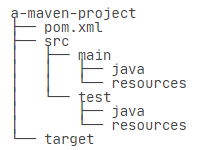
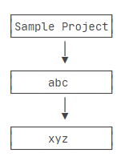
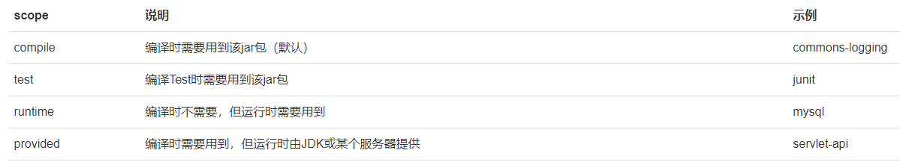
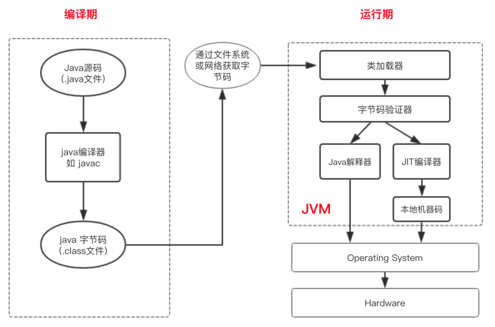
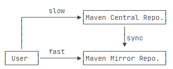

# learn-3

## 1.maven 基础

参考文章：https://www.liaoxuefeng.com/wiki/1252599548343744/1255945359327200。

### 1.1.Maven 介绍

Maven 是专门为Java项目打造的管理和构建工具，它的主要功能有：

- 提供了一套标准化的项目结构。
- 提供了一套标准化的构建流程（编译，测试，打包，发布……）。
- 提供了一套依赖管理机制。

一个使用 Maven 管理的普通的 Java 项目，它的目录结构默认如下：

项目的根目录`a-maven-project`是项目名，它有一个项目描述文件`pom.xml`，存放Java源码的目录是`src/main/java`，存放资源文件的目录是`src/main/resources`，存放测试源码的目录是`src/test/java`，存放测试资源的目录是`src/test/resources`，最后，所有编译、打包生成的文件都放在`target`目录里。这些就是一个Maven项目的标准目录结构。

> 目录结构都是约定好的标准结构，不能随意修改目录结构。使用标准结构不需要做任何配置，Maven 就可以正常使用。

项目描述文件 `pom.xml` 是 maven 工程中的关键文件。其中的 `groupId`、`artifactId` 和 `version` 就是标识一个 Maven 工程的三大要素（同时其也能唯一定位一个依赖）。可以使用`<dependency>`声明一个依赖后，Maven就会自动下载这个依赖包并把它放到classpath中。

### 1.2.依赖管理

Maven解决了依赖管理问题。例如，我们的项目依赖`abc`这个jar包，而`abc`又依赖`xyz`这个 jar 包：

当我们声明了`abc`的依赖时，Maven自动把`abc`和`xyz`都加入了我们的项目依赖，不需要我们自己去研究`abc`是否需要依赖`xyz`。

Maven定义了几种依赖关系，分别是`compile`、`test`、`runtime`和`provided`：

> 为了更好地理解编译器和运行期，下面给出了 Java 的执行流程：
>
> 
>
> 参考文章：https://www.cnblogs.com/javastack/p/13397621.html。

Maven维护了一个中央仓库（[repo1.maven.org](https://repo1.maven.org/)），所有第三方库将自身的jar以及相关信息上传至中央仓库，Maven就可以从中央仓库把所需依赖下载到本地。

>Maven并不会每次都从中央仓库下载jar包。一个jar包一旦被下载过，就会被Maven自动缓存在本地目录（用户主目录的`.m2`目录），所以，除了第一次编译时因为下载需要时间会比较慢，后续过程因为有本地缓存，并不会重复下载相同的jar包。

对于某个依赖，Maven只需要3个变量即可唯一确定某个jar包：

- groupId：属于组织的名称，类似Java的包名；
- artifactId：该jar包自身的名称，类似Java的类名；
- version：该jar包的版本。

后续我们在表示Maven依赖时，使用简写形式groupId:artifactId:version，例如：org.slf4j:slf4j-api:2.0.4。

除了可以从Maven的中央仓库下载外，还可以从Maven的镜像仓库下载。如果访问Maven的中央仓库非常慢，我们可以选择一个速度较快的Maven的镜像仓库。Maven镜像仓库定期从中央仓库同步：

如果我们要引用一个第三方组件，比如`okhttp`，如何确切地获得它的`groupId`、`artifactId`和`version`？方法是通过 [search.maven.org](https://search.maven.org/) 搜索关键字，找到对应的组件后，直接复制。

完成开发与测试工作之后，进入到 `pom.xml` 所在的目录，输入 `mvn clean package`，如果一切顺利即可在 `target` 目录下获得编译后自动打包的 jar。 

> `mvn clean package` 的意思是使用 Maven 构建项目之前，先执行清理操作，然后进行编译、测试和打包，生成最终的构建产物。
>
> * `clean` 是 Maven 的一种构建生命周期阶段，它会删除先前构建生成的文件和目录。这是一个可选步骤，可以确保每次构建都是从头开始的，清除之前的构建残留。
> * `package` 是 Maven 的另一个构建生命周期阶段，它将项目编译、测试（**即执行 Test 目录下的测试**），并将项目打包为可部署的格式（例如 JAR 文件或 WAR 文件）。在这个阶段，Maven 会执行项目的编译、测试和打包操作，并生成最终的构建产物。

### 1.3.构建流程

## 2.多线程

