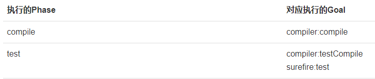
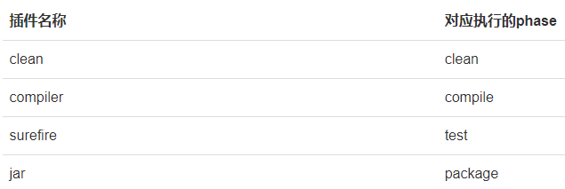
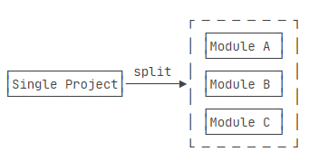
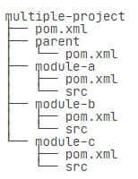
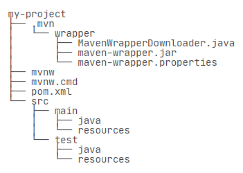
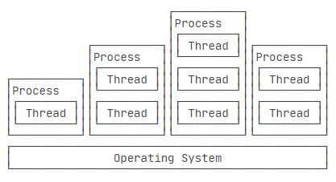
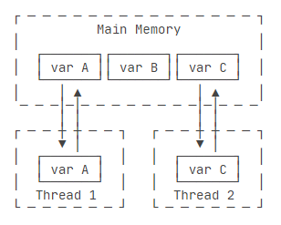
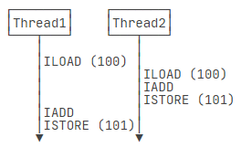
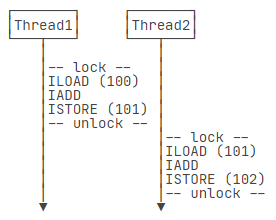

# learn-3

## 1.maven 基础

参考文章：https://www.liaoxuefeng.com/wiki/1252599548343744/1255945359327200。

### 1.1.Maven 介绍

Maven 是专门为Java项目打造的管理和构建工具，它的主要功能有：

- 提供了一套标准化的项目结构。
- 提供了一套标准化的构建流程（编译，测试，打包，发布……）。
- 提供了一套依赖管理机制。

一个使用 Maven 管理的普通的 Java 项目，它的目录结构默认如下：


项目的根目录`a-maven-project`是项目名，它有一个项目描述文件`pom.xml`，存放Java源码的目录是`src/main/java`，存放资源文件的目录是`src/main/resources`，存放测试源码的目录是`src/test/java`，存放测试资源的目录是`src/test/resources`，最后，所有编译、打包生成的文件都放在`target`目录里。这些就是一个Maven项目的标准目录结构。

> 目录结构都是约定好的标准结构，不能随意修改目录结构。使用标准结构不需要做任何配置，Maven 就可以正常使用。

项目描述文件 `pom.xml` 是 maven 工程中的关键文件。其中的 `groupId`、`artifactId` 和 `version` 就是标识一个 Maven 工程的三大要素（同时其也能唯一定位一个依赖）。可以使用`<dependency>`声明一个依赖后，Maven就会自动下载这个依赖包并把它放到classpath中。

### 1.2.依赖管理

Maven解决了依赖管理问题。例如，我们的项目依赖`abc`这个jar包，而`abc`又依赖`xyz`这个 jar 包：


当我们声明了`abc`的依赖时，Maven自动把`abc`和`xyz`都加入了我们的项目依赖，不需要我们自己去研究`abc`是否需要依赖`xyz`。

Maven定义了几种依赖关系，分别是`compile`、`test`、`runtime`和`provided`：


**为什么 mysql 的 scope 是 runtime，为什么 servlet-api 的 scope 是 provided？**

> 为了更好地理解编译器和运行期，下面给出了 Java 的执行流程：
>
> 
>
> 参考文章：https://www.cnblogs.com/javastack/p/13397621.html。

Maven维护了一个中央仓库（[repo1.maven.org](https://repo1.maven.org/)），所有第三方库将自身的jar以及相关信息上传至中央仓库，Maven就可以从中央仓库把所需依赖下载到本地。

>Maven并不会每次都从中央仓库下载jar包。一个jar包一旦被下载过，就会被Maven自动缓存在本地目录（用户主目录的`.m2`目录），所以，除了第一次编译时因为下载需要时间会比较慢，后续过程因为有本地缓存，并不会重复下载相同的jar包。

对于某个依赖，Maven只需要3个变量即可唯一确定某个jar包：

- groupId：属于组织的名称，类似Java的包名；
- artifactId：该jar包自身的名称，类似Java的类名；
- version：该jar包的版本。

后续我们在表示Maven依赖时，使用简写形式groupId:artifactId:version，例如：org.slf4j:slf4j-api:2.0.4。

除了可以从Maven的中央仓库下载外，还可以从Maven的镜像仓库下载。如果访问Maven的中央仓库非常慢，我们可以选择一个速度较快的Maven的镜像仓库。Maven镜像仓库定期从中央仓库同步：


如果我们要引用一个第三方组件，比如`okhttp`，如何确切地获得它的`groupId`、`artifactId`和`version`？方法是通过 [search.maven.org](https://search.maven.org/) 搜索关键字，找到对应的组件后，直接复制。

完成开发与测试工作之后，进入到 `pom.xml` 所在的目录，输入 `mvn clean package`，如果一切顺利即可在 `target` 目录下获得编译后自动打包的 jar。 

> `mvn clean package` 的意思是使用 Maven 构建项目之前，先执行清理操作，然后进行编译、测试和打包，生成最终的构建产物。
>
> * `clean` 是 Maven 的一种构建生命周期阶段，它会删除先前构建生成的文件和目录。这是一个可选步骤，可以确保每次构建都是从头开始的，清除之前的构建残留。
> * `package` 是 Maven 的另一个构建生命周期阶段，它将项目编译、测试（**即执行 Test 目录下的测试**），并将项目打包为可部署的格式（例如 JAR 文件或 WAR 文件）。在这个阶段，Maven 会执行项目的编译、测试和打包操作，并生成最终的构建产物。

### 1.3.构建流程

在使用 Maven 时，我们首先需要了解什么是 Maven 的生命周期（**lifecycle**）。Maven的生命周期由一系列阶段（**phase**）构成，以内置的生命周期 `default` 为例，它包含以下 phase：

- validate
- initialize
- generate-sources
- process-sources
- generate-resources
- process-resources
- compile
- process-classes
- generate-test-sources
- process-test-sources
- generate-test-resources
- process-test-resources
- test-compile
- process-test-classes
- test
- prepare-package
- package
- pre-integration-test
- integration-test
- post-integration-test
- verify
- install
- deploy

如果我们运行 `mvn package`，Maven就会执行`default`生命周期，它会从开始一直运行到`package`这个phase为止：

- validate
- ...
- package

Maven另一个常用的生命周期是`clean`，它会执行3个phase：

- pre-clean
- clean （注意这个clean不是lifecycle而是phase）
- post-clean

当我们使用 `mvn` 这个命令时，后面的参数是 phase，Maven 自动根据生命周期运行到指定的 phase。

更复杂的例子是指定多个phase，例如，运行`mvn clean package`，Maven先执行`clean`生命周期并运行到`clean`这个phase，然后执行`default`生命周期并运行到`package`这个phase，实际执行的phase如下：

> `mvn clean` 表示清理所有生成的 class 和 jar。

- pre-clean
- clean （注意这个clean是phase）
- validate
- ...
- package

除了 lifecycle 和 phase 的概念之外，还有 goal：



goal的命名总是 `abc:xyz` 这种形式，其中 `abc` 是 `plugin` 名称，`xyz` 是 `goal` 名称。

可以通过类比的方式理解 maven 中的 lifecycle、phase、goal 概念：

- lifecycle相当于Java的package，它包含一个或多个phase。
- phase相当于Java的class，它包含一个或多个goal。
- goal相当于class的method，它其实才是真正干活的。

大多数情况，我们只要指定phase，就默认执行这些phase默认绑定的goal，只有少数情况，我们可以直接指定运行一个goal，例如，启动Tomcat服务器：

```shell
mvn tomcat:run
```

### 1.4.使用插件

实际上，执行每个phase，都是通过某个插件（plugin）来执行的，Maven本身其实并不知道如何执行`compile`，它只是负责找到对应的`compiler`插件，然后执行默认的`compiler:compile`这个goal来完成编译。

>使用Maven，实际上就是配置好需要使用的插件，然后通过phase调用它们。

使用Maven，实际上就是配置好需要使用的插件，然后通过phase调用它们。Maven已经内置了一些常用的标准插件：



如果标准插件无法满足需求，我们还可以引入外部插件。引入外部插件时需要声明，例如，使用 `maven-shade-plugin` 可以创建一个可执行的 `jar`，要使用这个插件，需要在 `pom.xml` 中声明它：

> 此处可参考文章：https://blog.csdn.net/weixin_43935927/article/details/109584893。

```xml
<project>
    ...
	<build>
		<plugins>
			<plugin>
				<groupId>org.apache.maven.plugins</groupId>
				<artifactId>maven-shade-plugin</artifactId>
                <version>3.2.1</version>
                <!-- 指定插件的坐标 -->
				<executions>
					<execution>
						<phase>package</phase>
                        <!-- 指定了在哪一个 phase 执行该插件 -->
                        <!-- 该插件将在执行到相应的 phase 时被自动调用 -->
						<goals>
							<goal>shade</goal>
						</goals>
						<configuration>
                            <!-- 指定插件的配置，这因插件而异 -->
                            <!-- 插件的配置和用法需参考插件的官方文档 -->
                            ...
						</configuration>
					</execution>
				</executions>
			</plugin>
		</plugins>
	</build>
</project>
```

注意，Maven 自带的标准插件例如`compiler`是无需声明的，只有引入外部的自定义插件时才需要声明。

### 1.5.模块管理

在软件开发中，把一个大项目分拆为多个模块是降低软件复杂度的有效方法：



Maven可以有效地管理多个模块，我们只需要把每个模块当作一个独立的Maven项目，它们有各自独立的`pom.xml`：



其中的 parent/pom.xml 是为了复用各个 module 中的配置，只需要在原来 module 的 pom.xml 加入：

```xml
    <parent>
        <groupId>com.itranswarp.learnjava</groupId>
        <artifactId>parent</artifactId>
        <version>1.0</version>
        <relativePath>../parent/pom.xml</relativePath>
    </parent>
```

如果 module-a 依赖 module-b，则 module-a 需要 module-b 的 jar 包才能正常编译，我们需要在 module-a 中引入 module-b：

```xml
    ...
    <dependencies>
        <dependency>
            <groupId>com.itranswarp.learnjava</groupId>
            <artifactId>module-b</artifactId>
            <version>1.0</version>
        </dependency>
    </dependencies>
```

最后，在编译的时候，需要在根目录创建一个`pom.xml`统一编译：

```xml
    <modules>
        <module>parent</module>
        <module>module-a</module>
        <module>module-b</module>
        <module>module-c</module>
    </modules>
```

这样，在根目录执行`mvn clean package`时，Maven根据根目录的`pom.xml`找到包括`parent`在内的共4个`<module>`，一次性全部编译。

maven 的 pom.xml 文件中所定义的依赖可以从以下三种依赖仓库中拉取：

* 中央仓库，即公有仓库。
* 私有仓库，即内部搭建的不对外公开的仓库。
* 本地仓库，即本地 jar 包，但可由 Maven 管理。

> 从这个功能看，maven 有点类似于 npm，但实际上比 npm 要强大许多，譬如还具有多包管理（npm 生态中由 Lerna 完成）、编译、打包（这或许对应 webpack）等功能。

### 1.6.使用 mvnw

`mvnw` 是 Maven Wrapper的缩写。因为我们安装Maven时，默认情况下，系统所有项目都会使用全局安装的这个Maven版本。但是，对于某些项目来说，它可能必须使用某个特定的Maven版本，这个时候，就可以使用Maven Wrapper，它可以负责给这个特定的项目安装指定版本的Maven，而其他项目不受影响。

简单地说，Maven Wrapper就是给一个项目提供一个独立的，指定版本的Maven给它使用。

> 对应前端生态中管理 node 所使用的工具 n。

mvnw 安装过程暂略，安装后项目目录结构如下：



不难看出，多出了 mvnw、mvnw.cmd 和 .mvn 目录，我们只需要把`mvn`命令改成`mvnw`就可以使用跟项目关联的Maven。

> Maven Wrapper 的另一个作用是把项目的 `mvnw`、`mvnw.cmd` 和 `.mvn` 提交到版本库中，可以使所有开发人员使用统一的 Maven 版本。

### 1.7.发布 Artifact

> 本节主要介绍如何将自己的开源库发布到 Maven 的 repo 中，暂时省略。

参考文章：https://www.liaoxuefeng.com/wiki/1252599548343744/1347981037010977

## 2.多线程

参考文章：https://www.liaoxuefeng.com/wiki/1252599548343744/1255943750561472

### 2.1.多线程基础

在计算机中，我们把一个任务称为一个进程，某些进程内部还需要同时执行多个子任务，我们把子任务称为线程。

进程和线程的关系就是：一个进程可以包含一个或多个线程，但至少会有一个线程。



操作系统调度的最小任务单位其实不是进程，而是线程。

和多线程相比，多进程有如下缺点：

* 创建进程比创建线程开销大，尤其是在Windows系统上；
* 进程间通信比线程间通信要慢，因为线程间通信就是读写同一个变量，速度很快。

而多进程的优点在于，多进程稳定性比多线程高，因为在多进程的情况下，一个进程崩溃不会影响其他进程，而在多线程的情况下，任何一个线程崩溃会直接导致整个进程崩溃。

> 面试题，为什么线程崩溃不会导致 JVM 崩溃呢？
>
> 参考文章：https://cloud.tencent.com/developer/article/2091606。

Java语言内置了多线程支持：一个Java程序实际上是一个JVM进程，JVM进程用一个主线程来执行`main()`方法，在`main()`方法内部，我们又可以启动多个线程。此外，JVM还有负责垃圾回收的其他工作线程等。

对于大多数 Java 程序来说，我们说多任务，实际上是说如何使用多线程实现多任务。和单线程相比，多线程编程的特点在于：多线程经常需要读写共享数据，并且需要同步。

### 2.2.创建新线程

JVM 进程的主线程是 main 方法，在 main 方法中，我们又可以启动其他线程，如下所示：

```java
Thread t = new Thread(); // 需要覆盖 Thread 类中的 run() 方法。
t.start(); // 启动新线程
```

> 一个线程对象只能调用一次 start 方法。

在线程中可以调用 `Thread.sleep()` 来实现线程暂停，sleep 传入的参数是毫秒。

要特别注意：直接调用 Thread 实例的 run() 方法是无法开启一个新线程的，其相当于调用了一个普通的 Java 方法。**必须调用`Thread`实例的`start()`方法才能启动新线程**，如果我们查看`Thread`类的源代码，会看到`start()`方法内部调用了一个`private native void start0()`方法，**`native`修饰符表示这个方法是由JVM虚拟机内部的C代码实现的，不是由Java代码实现的**。

可以对线程设定优先级，设定优先级的方法如下：

```java
Thread.setPriority(int n) // 1~10, 默认值 5
```

JVM自动把1（低）~10（高）的优先级映射到操作系统实际优先级上（不同操作系统有不同的优先级数量）。优先级高的线程被操作系统调度的优先级较高，操作系统对高优先级线程可能调度更频繁，但我们决不能通过设置优先级来确保高优先级的线程一定会先执行。

### 2.3.线程的状态

在Java程序中，一个线程对象只能调用一次`start()`方法启动新线程，并在新线程中执行`run()`方法。一旦`run()`方法执行完毕，线程就结束了。因此，Java线程的状态有以下几种：

- New：新创建的线程，尚未执行。
- Runnable：运行中的线程，正在执行`run()`方法的Java代码。
- Blocked：运行中的线程，因为某些操作被阻塞而挂起。
- Waiting：运行中的线程，因为某些操作在等待中。
- Timed Waiting：运行中的线程，因为执行`sleep()`方法正在计时等待。
- Terminated：线程已终止，因为`run()`方法执行完毕。

当线程启动后，它可以在`Runnable`、`Blocked`、`Waiting`和`Timed Waiting`这几个状态之间切换，直到最后变成`Terminated`状态，线程终止。

线程终止的原因有：

- 线程正常终止：`run()`方法执行到`return`语句返回；
- 线程意外终止：`run()`方法因为未捕获的异常导致线程终止；
- 对某个线程的`Thread`实例调用`stop()`方法强制终止（强烈不推荐使用）。

一个线程还可以等待另一个线程直到其运行结束。例如，`main`线程在启动`t`线程后，可以通过`t.join()`等待`t`线程结束后再继续运行：

```java
public class Main {
    public static void main(String[] args) throws InterruptedException {
        Thread t = new Thread(() -> {
            System.out.println("hello");
        });
        System.out.println("start");
        t.start();
        t.join();
        System.out.println("end");
    }
}
```

> 如果，`t`线程已经结束，那么对实例 `t` 调用`join()`会立刻返回。此外，`join(long)`的重载方法也可以指定一个等待时间，超过等待时间后就不再继续等待。

### 2.4.中断线程

如果线程需要执行一个长时间任务，就可能需要能中断线程。中断线程就是其他线程给该线程发一个信号，该线程收到信号后结束执行`run()`方法，使得自身线程能立刻结束运行。

> 我们举个栗子：假设从网络下载一个100M的文件，如果网速很慢，用户等得不耐烦，就可能在下载过程中点“取消”，这时，程序就需要中断下载线程的执行。

中断一个线程非常简单，只需要在其他线程中对目标线程调用`interrupt()`方法，目标线程需要反复检测自身状态是否是 interrupted 状态，如果是，就立刻结束运行。实例代码如下：

```java
public class Main {
    public static void main(String[] args) throws InterruptedException {
        Thread t = new MyThread();
        t.start();
        Thread.sleep(1); // 暂停 1 毫秒
        t.interrupt(); // 中断 t 线程
        t.join(); // 等待 t 线程结束
        System.out.println("end");
    }
}

class MyThread extends Thread {
    public void run() {
        int n = 0;
        while (!isInterrupted()) {
            // 其中，isInterrupted 是 Thread 已经实现的方法。
            n ++;
            System.out.println(n + " hello!");
        }
    }
}
```

> `interrupt()`方法仅仅向`t`线程发出了“中断请求”，至于`t`线程是否能立刻响应，要看具体代码。

**如果线程处于等待状态**，例如，`t.join()` 会让 `main` 线程进入等待状态，此时，**如果对 `main` 线程调用 `interrupt()`，`join()`方法会立刻抛出`InterruptedException`**，因此，目标线程只要捕获到`join()`方法抛出的`InterruptedException`，就说明有其他线程对其调用了`interrupt()`方法，通常情况下该线程应该立刻结束运行。

另一个常用的中断线程的方法是设置标志位。我们通常会用一个 `running` 标志位来标识线程是否应该继续运行，在外部线程中，通过把`HelloThread.running`置为`false`，就可以让线程结束，代码示例如下：

```java
public class Main {
    public static void main(String[] args)  throws InterruptedException {
        HelloThread t = new HelloThread();
        t.start();
        Thread.sleep(1);
        t.running = false; // 标志位置为false
    }
}

class HelloThread extends Thread {
    public volatile boolean running = true;
    public void run() {
        int n = 0;
        while (running) {
            n ++;
            System.out.println(n + " hello!");
        }
        System.out.println("end!");
    }
}
```

注意到`HelloThread`的标志位`boolean running`是一个线程间共享的变量。线程间共享变量需要使用`volatile`关键字标记，确保每个线程都能读取到更新后的变量值。

为什么要对线程间共享的变量用关键字`volatile`声明？这涉及到Java的内存模型。在 Java 虚拟机中，**变量的值保存在主内存中**，但是，当线程访问变量时，它会先获取一个副本，并保存在自己的工作内存中。如果线程修改了变量的值，虚拟机会在某个时刻把修改后的值回写到主内存，但是，这个时间是不确定的。



这会导致如果一个线程更新了某个变量，另一个线程读取的值可能还是更新前的。例如，主内存的变量`a = true`，线程1执行`a = false`时，它在此刻仅仅是把变量`a`的副本变成了`false`，主内存的变量`a`还是`true`，在JVM把修改后的`a`回写到主内存之前，其他线程读取到的`a`的值仍然是`true`，这就造成了多线程之间共享的变量不一致。

因此，`volatile` 关键字的目的是告诉虚拟机：

* 每次访问变量时，总是获取主内存的最新值。
* 每次修改变量后，立刻回写到主内存。

`volatile`关键字解决的是可见性问题：当一个线程修改了某个共享变量的值，其他线程能够立刻看到修改后的值。

>如果我们去掉`volatile`关键字，运行上述程序，发现效果和带`volatile`差不多，这是因为在x86的架构下，JVM回写主内存的速度非常快，但是，换成ARM的架构，就会有显著的延迟。

### 2.5.守护线程

Java 程序入口就是由 JVM 启动`main`线程，`main`线程又可以启动其他线程。当所有线程都运行结束时，JVM 退出，进程结束。

> JVM 进程退出时 cmd 会显示 `进程已结束，退出代码为 0`。

如果有一个线程没有退出，JVM进程就不会退出。所以，必须保证所有线程都能及时结束。但是有一种线程的目的就是无限循环，例如一个定时触发任务的线程。

如何在其他线程结束时，也结束定时任务线程，好让 JVM 退出呢？使用守护线程。

守护线程是指为其他线程服务的线程。在JVM中，所有非守护线程都执行完毕后，无论有没有守护线程，虚拟机都会自动退出。**JVM退出时，不必关心守护线程是否已结束。**

创建守护线程的方式和创建普通线程的方式一致，只是在调用 `start()` 方法前，需要调用 `setDaemon(true)` 把该线程标记为守护线程。

```java
Thread t = new MyThread();
t.setDaemon(true);
t.start();
```

在守护线程中，编写代码要注意：**守护线程不能持有任何需要关闭的资源**，例如打开文件等，因为虚拟机退出时，守护线程没有任何机会来关闭文件，这会导致数据丢失。

### 2.6.线程同步

当多个线程同时运行时，线程的调度由操作系统决定，程序本身无法决定。因此，任何一个线程都有可能在任何指令处被操作系统暂停，然后在某个时间段后继续执行。这个时候，有个单线程模型下不存在的问题就来了：**如果多个线程同时读写共享变量，会出现数据不一致的问题**。

例如对于语句：

```java
n = n + 1;
```

看上去是一行语句，实际上对应了3条指令：

* ILOAD
* IADD
* ISTORE

我们假设`n`的值是`100`，如果两个线程同时执行`n = n + 1`，得到的结果很可能不是`102`，而是`101`，原因在于：



如果线程1在执行`ILOAD`后被操作系统中断，此刻如果线程2被调度执行，它执行`ILOAD`后获取的值仍然是`100`，最终结果被两个线程的`ISTORE`写入后变成了`101`，而不是期待的`102`。

这说明多线程模型下，要保证逻辑正确，对共享变量进行读写时，必须保证一组指令以原子方式执行：**即某一个线程执行时，其他线程必须等待**。



保证一段代码的原子性就是通过加锁和解锁实现的。Java程序使用`synchronized`关键字对一个对象进行加锁：

```java
synchronized(lock) {
    n = n + 1;
}
// lock 是一个变量，是关键的锁，一般为了保证代码的原子性，多个 synchronized 会共享同一个锁。
// 进入代码块后，synchronized 会自动获取锁，而执行完之后，synchronized 则会自动释放锁。
```

使用`synchronized`解决了多线程同步访问共享变量的正确性问题。**但是，它的缺点是带来了性能下降。因为`synchronized`代码块无法并发执行**。此外，加锁和解锁需要消耗一定的时间，所以，`synchronized`会降低程序的执行效率。

> 在使用`synchronized`的时候，不必担心抛出异常。因为无论是否有异常，都会在`synchronized`结束处正确释放锁。

JVM规范定义了几种原子操作，这些原子操作不需要 synchronized 操作：

- 基本类型（`long`和`double`除外）赋值，例如：`int n = m`。
- 引用类型赋值，例如：`List<String> list = anotherList`。


