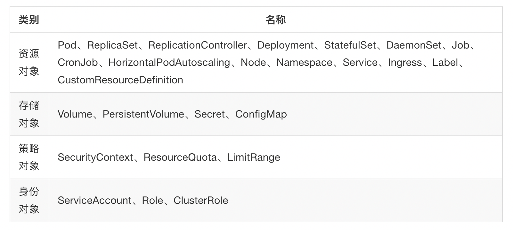

# learn-java-2

## 1.pvc、pv 与 pod 申领的 volume 分别是什么？

pvc 和 pod 申领的 volume 都是抽象的概念。

只有 pv 才是实际的磁盘。

对于如下 yaml 文件：

```yaml
kind: Pod
metadata:
  name: my-pod
spec:
  volumes:
    - name: my-volume
      persistentVolumeClaim:
        claimName: my-pvc
  containers:
    - name: my-container
      image: nginx
      volumeMounts:
        - name: my-volume
          mountPath: /data
```

其中的 volumes 配置表示，pod 将会申领一个 volume，规格按照名称为 my-pvc 的 pvc 配置文件来，其名称为 my-volume。这将会让该 pod 通过拥有 pv 来实际占据一部分磁盘空间。 

这块 volume 将会供 pod 中的 container 使用。

## 2.主机网络和端口映射？

在 Kubernetes 中，Pod 是最小的可部署单元，它可以包含一个或多个容器。每个 Pod 都有自己的 IP 地址，并且可以在其中运行一些服务。在 Pod 中，可以定义端口映射和主机网络选项。

>在Kubernetes中，每个Pod都有自己的IP地址。如果启动了主机网络模式，那么这个 ip 与其所在节点的IP地址是相同的，它们共享相同的网络命名空间。但是，如果 hostnetwork == false（默认值），那么该IP地址是在Pod创建时由Kubernetes分配的。

### 2.1.端口映射

Pod 可以通过端口映射将容器内部的端口映射到外部。在 Kubernetes 中，可以使用 `ports` 字段来定义端口映射。例如，下面的 YAML 配置文件定义了一个 Pod，该 Pod 包含一个名为 `my-container` 的容器，该容器将其内部的 `8080` 端口映射到 Pod 的 `80` 端口。

```yaml
apiVersion: v1
kind: Pod
metadata:
  name: my-pod
spec:
  containers:
    - name: my-container
      image: my-image
      ports:
        - containerPort: 8080
          hostPort: 80
```

这样，当 Pod 运行时，可以通过访问 Pod 的 IP 地址和 `80` 端口访问容器内部的 `8080` 端口。

### 2.2.主机网络

另一种 Pod 的网络模式是主机网络模式。在主机网络模式下，Pod 中的容器将共享主机的网络命名空间，从而使容器可以访问主机上的所有网络接口和端口。要使用主机网络模式，可以在 Pod 的 YAML 配置文件中设置 `hostNetwork` 选项为 `true`。例如，下面的 YAML 配置文件定义了一个使用主机网络模式的 Pod：

```yaml
apiVersion: v1
kind: Pod
metadata:
  name: my-pod
spec:
  hostNetwork: true
  containers:
    - name: my-container
      image: my-image
```

使用主机网络模式可以提高容器的网络性能，但也会带来一些安全风险，因为容器可以访问主机上的所有网络接口和端口。因此，需要在使用主机网络模式时进行谨慎的配置和管理。

## 3.如何将 swagger2 集成到 springboot 中？

首先需要引入依赖，然后需要编写 Swagger 配置类，一个例子如下所示：

```java
@Configuration
@EnableSwagger2
public class SwaggerConfiguration {
    @Bean
    public Docket createRestApi() {
        return new Docket(DocumentationType.SWAGGER_2)
                .apiInfo(apiInfo())
                .select()
                .apis(RequestHandlerSelectors.basePackage("com.example.versiondemo"))
                .paths(PathSelectors.any())
                .build().useDefaultResponseMessages(false);
    }

    private ApiInfo apiInfo() {
        return new ApiInfoBuilder()
                .title("edge-api@version-demo")
                .description("漠坦尼")
                .version("0.1")
                .build();
    }
}
```

其中的 @Configuration（Spring 提供的）和 @EnableSwagger2 注解含义如下：

* @Configuration：这个注解表示标记了该类为一个配置类，**它会被Spring容器扫描并加载。配置类用于定义和管理应用程序的配置信息，包括Bean的创建、组件扫描、数据库连接等**。
* @EnableSwagger2：这个注解用于启用Swagger 2在Spring应用程序中的集成。Swagger是一个用于设计、构建、文档化和使用RESTful风格的Web服务的工具。通过@EnableSwagger2注解，我们可以方便地将Swagger整合到Spring项目中，并自动生成API文档。。

## 4.如何解决 Maven 的依赖冲突问题？

Maven 依赖关系遵循最短路径原则：

1. 若两个版本不同的同一依赖，在不同的级别中，那么优先使用路径最短的那一个。
2. 如果该依赖位于不同的等级，那么分两种情况。若在第一级，那么谁后声明则引用谁；若不在第一级，那么谁先声明则引用谁。

如何解决依赖冲突问题呢？最简单的方法是清空原有的本地 maven 仓库。还有一种方式是排除插件手动选择使用哪个版本的依赖，基于 maven helper 插件，详见文章 https://www.cnblogs.com/qdhxhz/p/16363532.html。

## 5.什么是 Kubernetes 的 CRD？

什么是 Kubernetes 的资源呢？如下所示：



而 CRD，全称 CustomResourceDefinition，是一种自定义的Kubernetes资源，在定义 CRD 后，可通过在集群内创建对应 CR(CustomResource) 对有状态应用进行统一管理。CRD 有如下字段：

- group，一般为组织名称，如：osctest。（withGroup）
- API 版本，第一个版本一般为v1。（withVersion）
- scope，Namespaced 级别，修改为Cluster级别，则集群内仅可以创建一个同名的CR。仅Cluster级别的operator可管理同级别CRD。（withScope）
- API名称，假设应用名称为hwfka，则对应的多种名称格式如下：
  - API名称：kind: Hwfka，创建API的时候使用。（withKind）
  - 列表形式：listKind: HwfkaList。
  - 复数形式：plural: hwfkas。（withPlural）
  - 单数形式：singular: hwfka。
  - 简称：shortNames: hfk。

## 6. GitHub 开源项目的 api 文档在哪儿？

除了 README.md 以外，也要关注一下 doc 目录下的 .md 文档。


