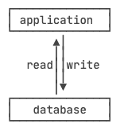
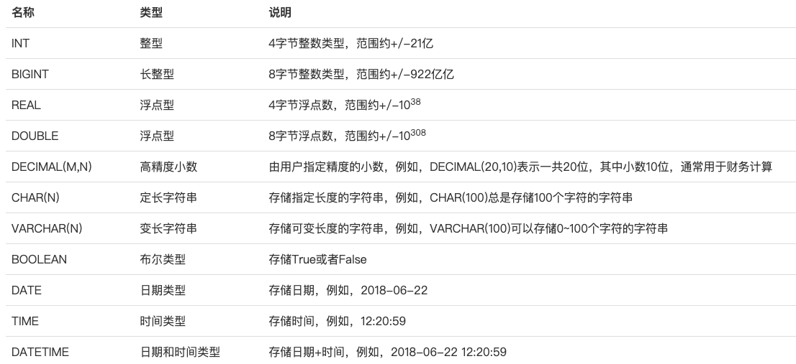
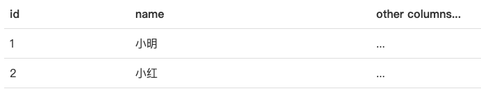

# learn-1

## 1.数据库基本概念

> SQL 和 NoSQL，前者一般适用于存储相互之间有关联的数据，而后者则是主要用于存储零散的、相互独立的数据。

数据库是一种专门管理数据的软件，应用程序不需要自己管理数据，而是通过数据库软件提供的接口来读写数据。至于数据本身如何存储到文件，那是数据库软件的事情，应用程序自己并不关心：



数据库有三种模型（层次模型、网状模型、**关系模型**），但是我们一般使用关系模型，基于数学理论的关系模型虽然讲起来复杂，但是用起来却比较容易理解。

对于一个关系表，除了定义每一列的名称外，还需要定义每一列的数据类型。关系数据库支持的标准数据类型包括数值、字符串、时间等：



选择数据类型的时候，要根据业务规则选择合适的类型。通常来说，`BIGINT`能满足整数存储的需求，`VARCHAR(N)`能满足字符串存储的需求，这两种类型是使用最广泛的。

## 2.SQL

什么是SQL？SQL是结构化查询语言的缩写，用来访问和操作数据库系统。SQL语句既可以查询数据库中的数据，也可以添加、更新和删除数据库中的数据，还可以对数据库进行管理和维护操作。不同的数据库，都支持SQL，这样，我们通过学习SQL这一种语言，就可以操作各种不同的数据库。

虽然SQL已经被ANSI组织定义为标准，不幸地是，各个不同的数据库对标准的SQL支持不太一致。并且，大部分数据库都在标准的SQL上做了扩展。也就是说，如果只使用标准SQL，理论上所有数据库都可以支持，但如果使用某个特定数据库的扩展SQL，换一个数据库就不能执行了。例如，Oracle把自己扩展的SQL称为`PL/SQL`，Microsoft把自己扩展的SQL称为`T-SQL`。

现实情况是，**如果我们只使用标准SQL的核心功能，那么所有数据库通常都可以执行。不常用的SQL功能，不同的数据库支持的程度都不一样**。而各个数据库支持的各自扩展的功能，通常我们把它们称之为“方言”。

总的来说，SQL语言定义了这么几种操作数据库的能力：

**DDL：Data Definition Language**

DDL允许用户定义数据，也就是创建表、删除表、修改表结构这些操作。通常，DDL由数据库管理员执行。

**DML：Data Manipulation Language**

DML为用户提供添加、删除、更新数据的能力，这些是应用程序对数据库的日常操作。

**DQL：Data Query Language**

DQL允许用户查询数据，这也是通常最频繁的数据库日常操作。

SQL语言关键字不区分大小写。但是，针对不同的数据库，对于表名和列名，有的数据库区分大小写，有的数据库不区分大小写。同一个数据库，有的在Linux上区分大小写，有的在Windows上不区分大小写。本教程约定，SQL关键字总是大写，以示突出，表名和列名均使用小写。

## 3.MySQL

和其他关系数据库有所不同的是，MySQL本身实际上只是一个SQL接口，它的内部还包含了多种**数据引擎**，常用的包括：

- InnoDB：由Innobase Oy公司开发的一款支持事务的数据库引擎，2006年被Oracle收购；
- MyISAM：MySQL早期集成的默认数据库引擎，不支持事务。

MySQL 接口和数据库引擎的关系就好比某某浏览器和浏览器引擎（IE引擎或Webkit引擎）的关系。对用户而言，**切换浏览器引擎不影响浏览器界面，切换MySQL引擎不影响自己写的应用程序使用MySQL的接口**。

使用MySQL时，不同的表还可以使用不同的数据库引擎。如果你不知道应该采用哪种引擎，记住总是选择 **InnoDB** 就好了。因为MySQL一开始就是开源的，所以基于MySQL的开源版本，又衍生出了各种版本：

* MariaDB，由MySQL的创始人创建的一个开源分支版本，使用XtraDB引擎。
* Aurora，由Amazon改进的一个MySQL版本，专门提供给在AWS托管MySQL用户，号称5倍的性能提升。
* PolarDB，由Alibaba改进的一个MySQL版本，专门提供给在阿里云托管的MySQL用户，号称6倍的性能提升。

而MySQL官方版本又分了好几个版本：

- Community Edition：社区开源版本，免费；
- Standard Edition：标准版；
- Enterprise Edition：企业版；
- Cluster Carrier Grade Edition：集群版。

以上版本的功能依次递增，价格也依次递增。不过，功能增加的主要是监控、集群等管理功能，对于基本的SQL功能是完全一样的。

## 4.关系模型

我们已经知道，关系数据库是建立在关系模型上的。而关系模型本质上就是若干个存储数据的二维表，可以把它们看作很多 Excel 表。表的每一行称为记录（Record），记录是一个逻辑意义上的数据。表的每一列称为字段（Column），同一个表的每一行记录都拥有相同的若干字段。

字段定义了数据类型（整型、浮点型、字符串、日期等），以及是否允许为`NULL`。注意`NULL`表示字段数据不存在。一个整型字段如果为`NULL`不表示它的值为`0`，同样的，一个字符串型字段为`NULL`也不表示它的值为空串`''`。

> 通常情况下，字段应该避免允许为NULL。不允许为NULL可以简化查询条件，加快查询速度，也利于应用程序读取数据后无需判断是否为NULL。

和Excel表有所不同的是，关系数据库的表和表之间需要建立“一对多”，“多对一”和“一对一”的关系，这样才能够按照应用程序的逻辑来组织和存储数据。在关系数据库中，关系是通过*主键*和*外键*来维护的。

### 4.1.主键

在关系数据库中，一张表中的每一行数据被称为一条记录。一条记录就是由多个字段组成的。每一条记录都包含若干定义好的字段。同一个表的所有记录都有相同的字段定义。对于关系表，有个很重要的约束，就是任意两条记录不能重复。**不能重复不是指两条记录不完全相同，而是指能够通过某个字段唯一区分出不同的记录，这个字段被称为主键**。

例如，假设我们把`name`字段作为主键，那么通过名字`小明`或`小红`就能唯一确定一条记录。但是，这么设定，就没法存储同名的同学了，因为插入相同主键的两条记录是不被允许的。

对主键的要求，最关键的一点是：记录一旦插入到表中，主键最好不要再修改，因为主键是用来唯一定位记录的，修改了主键，会造成一系列的影响。由于主键的作用十分重要，如何选取主键会对业务开发产生重要影响。如果我们以学生的身份证号作为主键，似乎能唯一定位记录。然而，身份证号也是一种业务场景，如果身份证号升位了，或者需要变更，作为主键，不得不修改的时候，就会对业务产生严重影响。

所以，选取主键的一个基本原则是：**不使用任何业务相关的字段作为主键**。

> 因此，身份证号、手机号、邮箱地址这些看上去可以唯一的字段，均*不可*用作主键。

作为主键最好是完全业务无关的字段，我们一般把这个字段命名为`id`。常见的可作为`id`字段的类型有：

1. 自增整数类型：数据库会在插入数据时自动为每一条记录分配一个自增整数，这样我们就完全不用担心主键重复，也不用自己预先生成主键；
2. 全局唯一GUID类型：使用一种全局唯一的字符串作为主键，类似`8f55d96b-8acc-4636-8cb8-76bf8abc2f57`。GUID算法通过网卡MAC地址、时间戳和随机数保证任意计算机在任意时间生成的字符串都是不同的，大部分编程语言都内置了GUID算法，可以自己预算出主键。

对于大部分应用来说，通常自增类型的主键就能满足需求。我们在`students`表中定义的主键也是`BIGINT NOT NULL AUTO_INCREMENT`类型。

>  如果使用INT自增类型，那么当一张表的记录数超过2147483647（约21亿）时，会达到上限而出错。使用BIGINT自增类型则可以最多约922亿亿条记录。

事实上，关系型数据库允许通过多个字段唯一标识记录，即两个或更多的字段都设置为主键，这种主键被称为联合主键。对于联合主键，允许一列有重复，只要不是所有主键列都重复即可。**没有必要的情况下，我们尽量不使用联合主键，因为它给关系表带来了复杂度的上升**。

创建主键的语法如下：

```sql
CREATE TABLE Persons
（
    P_Id int NOT NULL,
    LastName varchar(255) NOT NULL,
    FirstName varchar(255),
    Address varchar(255),
    City varchar(255),
    PRIMARY KEY (P_Id)
）；
```

### 4.2.外键

#### 4.2.1.一对多

通过一个一对多的例子来理解外键，当我们用主键唯一标识记录时，我们就可以在`students`表中确定任意一个学生的记录：



我们还可以在 `classes` 表中确定任意一个班级记录：


但是我们如何确定`students`表的一条记录，例如，`id=1`的小明，属于哪个班级呢？由于一个班级可以有多个学生，在关系模型中，这两个表的关系可以称为“一对多”，即一个`classes`的记录可以对应多个`students`表的记录。为了表达这种一对多的关系，我们需要在`students`表中加入一列`class_id`，让它的值与`classes`表的某条记录相对应。这样，我们就可以根据`class_id`这个列直接定位出一个`students`表的记录应该对应到`classes`的哪条记录。

例如：

- 小明的`class_id`是`1`，因此，对应的`classes`表的记录是`id=1`的一班；
- 小红的`class_id`是`1`，因此，对应的`classes`表的记录是`id=1`的一班；
- 小白的`class_id`是`2`，因此，对应的`classes`表的记录是`id=2`的二班。

在`students`表中，通过`class_id`的字段，可以把数据与另一张表关联起来，这种列称为`外键`。创建外键的语法如下：

```sql
ALTER TABLE students
ADD CONSTRAINT fk_class_id
FOREIGN KEY (class_id)
REFERENCES classes (id);
```

其中，外键约束的名称`fk_class_id`可以任意，`FOREIGN KEY (class_id)`指定了`class_id`作为外键，`REFERENCES classes (id)`指定了这个外键将关联到`classes`表的`id`列（即`classes`表的主键）。

**通过定义外键约束，关系数据库可以保证无法插入无效的数据。即如果`classes`表不存在`id=99`的记录，`students`表就无法插入`class_id=99`的记录。**

> 这就是外键的作用——限制。

由于外键约束会降低数据库的性能，**大部分互联网应用程序为了追求速度，并不设置外键约束，而是仅靠应用程序自身来保证逻辑的正确性**。这种情况下，`class_id`仅仅是一个普通的列，只是它起到了外键的作用而已。要删除一个外键约束，也是通过`ALTER TABLE`实现的：

```sql
ALTER TABLE students
DROP FOREIGN KEY fk_class_id;
```

注意：删除外键约束并没有删除外键这一列。删除列是通过`DROP COLUMN ...`实现的。

#### 4.2.2.多对多

**通过一个表的外键关联到另一个表，我们可以定义出一对多关系**。有些时候，还需要定义“多对多”关系。例如，一个老师可以对应多个班级，一个班级也可以对应多个老师，因此，班级表和老师表存在多对多关系。


### 4.3.约束

SQL 约束用于规定表中的数据规则。如果存在违反约束的数据行为，行为会被约束终止。约束可以在创建表时规定（通过 CREATE TABLE 语句），或者在表创建之后规定（通过 ALTER TABLE 语句）。语法如下：

```sql
CREATE TABLE table_name
（
		column_name1 data_type(size) constraint_name,
		column_name2 data_type(size) constraint_name,
		column_name3 data_type(size) constraint_name,
		...,
		constraint_name
）;
```

在 SQL 中，我们有如下约束：

- **NOT NULL** - 指示某列不能存储 NULL 值。
- **UNIQUE** - 保证某列的每行必须有唯一的值。
- **PRIMARY KEY** - NOT NULL 和 UNIQUE 的结合。确保某列（或两个列多个列的结合）有唯一标识，有助于更容易更快速地找到表中的一个特定的记录。
- **FOREIGN KEY** - 保证一个表中的数据匹配另一个表中的值的参照完整性。
- **CHECK** - 保证列中的值符合指定的条件。
- **DEFAULT** - 规定没有给列赋值时的默认值。

### 4.4.索引


