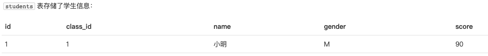
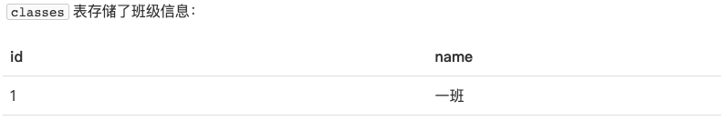
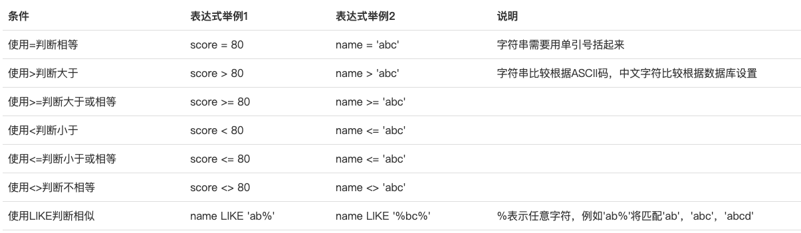
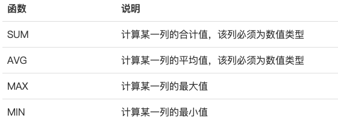
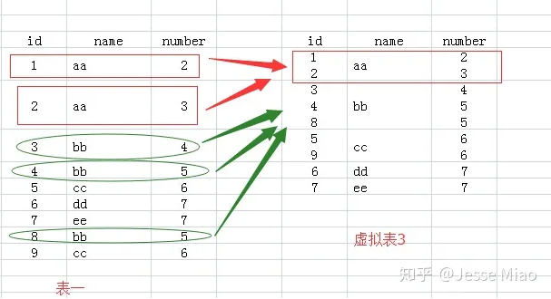
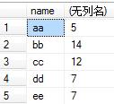
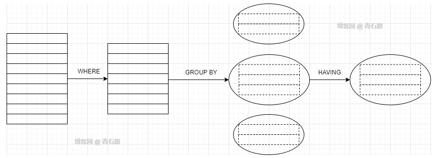

# learn-2

在关系数据库中，最常用的操作就是查询。下面是本章教程的表：





## 1.基本查询

要查询数据库表的数据，我们使用如下的SQL语句：

```sql
SELECT * FROM <表名>;
```

该SQL将查询出`students`表的所有数据。注意：查询结果也是一个二维表，它包含列名和每一行的数据。

`SELECT`语句其实并不要求一定要有`FROM`子句。不带`FROM`子句的`SELECT`语句有一个有用的用途，就是用来判断当前到数据库的连接是否有效。许多检测工具会执行一条`SELECT 1;`来测试数据库连接。

## 2.条件查询

条件查询的语法就是：

```sql
SELECT * FROM <表名> WHERE <条件表达式>
```

条件表达式可以用`<条件1> AND <条件2>`表达满足条件1并且满足条件2。

此外，还可以使用 `<条件1> OR <条件2>`，表示满足条件1或者满足条件2。

最后，第三种条件是`NOT <条件>`，表示“不符合该条件”的记录，例如：`SELECT * FROM students WHERE NOT class_id = 2;`。上述`NOT`条件`NOT class_id = 2`其实等价于`class_id <> 2`，因此，`NOT`查询不是很常用。

**要组合三个或者更多的条件，就需要用小括号`()`表示如何进行条件运算**。例如，编写一个复杂的条件：分数在80以下或者90以上，并且是男生：`SELECT * FROM students WHERE (score < 80 OR score > 90) AND gender = 'M';`。如果不加括号，条件运算按照`NOT`、`AND`、`OR`的优先级进行，即`NOT`优先级最高，其次是`AND`，最后是`OR`。加上括号可以改变优先级。



此外，还有 BETWEEN 条件、IN 条件等等。

## 3.投影查询

使用 `SELECT * FROM <表名> WHERE <条件>` 可以选出表中的若干条记录。我们注意到返回的二维表结构和原表是相同的，即结果集的所有列与原表的所有列都一一对应。如果我们只希望返回某些列的数据，而不是所有列的数据，我们可以用 `SELECT 列1, 列2, 列3 FROM ...`，让结果集仅包含指定列。这种操作称为**投影查询**。

使用`SELECT 列1, 列2, 列3 FROM ...`时，还可以给每一列起个别名，这样，结果集的列名就可以与原表的列名不同。它的语法是`SELECT 列1 别名1, 列2 别名2, 列3 别名3 FROM ...`。

> 此外，还可以使用 AS 关键词给字段和表起别名。

## 4.排序

我们使用SELECT查询时，细心的读者可能注意到，查询结果集通常是按照`id`排序的，也就是根据主键排序。这也是大部分数据库的做法。如果我们要根据其他条件排序怎么办？可以加上`ORDER BY`子句。

一般情况下，排序都是从小到大排序的，如果想要从大到小排序，那么我们可以加上 `DESC` 关键词。如果`score`列有相同的数据，要进一步排序，可以继续添加列名。例如，使用`ORDER BY score DESC, gender`表示先按`score`列倒序，如果有相同分数的，再按`gender`列排正序。

默认的排序规则是`ASC`：“升序”，即从小到大。`ASC`可以省略，即`ORDER BY score ASC`和`ORDER BY score`效果一样。

> 如果有`WHERE`子句，那么`ORDER BY`子句要放到`WHERE`子句后面。
>
> 可以这样理解，先进行条件查询，再对过滤后的数据进行排序是更加节省性能的做法。反之，即现对所以数据进行排序，然后做过滤则是对性能的浪费。

## 5.分页查询

使用SELECT查询时，如果结果集数据量很大，比如几万行数据，放在一个页面显示的话数据量太大，不如分页显示，每次显示100条。要实现分页功能，实际上就是从结果集中显示第1~100条记录作为第1页，显示第101~200条记录作为第2页，以此类推。

**因此，分页实际上就是从结果集中“截取”出第M~N条记录。这个查询可以通过`LIMIT <N-M> OFFSET <M>`子句实现**，例子如下所示：

* 把结果集分页，每页3条记录。要获取第1页的记录，可以使用`LIMIT 3 OFFSET 0`：`SELECT id, name, gender, score FROM students ORDER BY score DESC LIMIT 3 OFFSET 0;`。`LIMIT 3 OFFSET 0`表示，对结果集从0号记录开始，最多取3条。注意SQL记录集的索引从0开始。
* 如果要查询第2页，那么我们只需要“跳过”头3条记录，也就是对结果集从3号记录开始查询，把`OFFSET`设定为3。查询第3页的时候，`OFFSET`应该设定为6。查询第4页的时候，`OFFSET`应该设定为9。由于第4页只有1条记录，因此最终结果集按实际数量1显示。`LIMIT 3`表示的意思是“最多3条记录”。

综上，分页查询的关键在于，首先要确定每页需要显示的结果数量`pageSize`（这里是3），然后根据当前页的索引`pageIndex`（从1开始），确定`LIMIT`和`OFFSET`应该设定的值：

- `LIMIT`总是设定为`pageSize`；
- `OFFSET`计算公式为`pageSize * (pageIndex - 1)`。

这样就能正确查询出第N页的记录集。

> 需要注意的是：
>
> 1. `OFFSET`是可选的，如果只写`LIMIT 15`，那么相当于`LIMIT 15 OFFSET 0`。
> 2. 在MySQL中，`LIMIT 15 OFFSET 30`还可以简写成`LIMIT 30, 15`。
> 3. 使用`LIMIT <M> OFFSET <N>`分页时，随着`N`越来越大，查询效率也会越来越低。

## 6.聚合查询

对于统计总数、平均数这类计算，SQL提供了专门的聚合函数，使用聚合函数进行查询，就是聚合查询，它可以快速获得结果。以查询`students`表一共有多少条记录为例，我们可以使用SQL内置的`COUNT()`函数查询：

```sql
SELECT COUNT(*) FROM students;
```

`COUNT(*)`表示查询所有列的行数，要注意聚合的计算结果虽然是一个数字，但查询的结果仍然是一个二维表，只是这个二维表只有一行一列，并且列名是`COUNT(*)`。通常，使用聚合查询时，我们应该给列名设置一个别名（通过 AS），便于处理结果。

聚合查询可以使用 `WHERE` 条件，因此我们可以方便地统计出有多少男生、多少女生、多少80分以上的学生。另外，除了 `COUNT()` 函数，SQL 还提供了如下聚合函数：



> 注意：
>
> 1. `MAX()`和`MIN()`函数并不限于数值类型。如果是字符类型，`MAX()`和`MIN()`会返回排序最后和排序最前的字符。
> 2. 如果聚合查询的`WHERE`条件没有匹配到任何行，`COUNT()`会返回0，而`SUM()`、`AVG()`、`MAX()`和`MIN()`会返回`NULL`。

### 6.1.分组

如果我们要统计一班的学生数量，我们知道，可以用`SELECT COUNT(*) num FROM students WHERE class_id = 1;`。如果要继续统计二班、三班的学生数量，难道必须不断修改`WHERE`条件来执行`SELECT`语句吗？对于聚合查询，SQL还提供了“分组聚合”的功能：

```sql
SELECT COUNT(*) num FROM students GROUP BY class_id;
```

执行这个查询，`COUNT()`的结果不再是一个，而是3个，这是因为，`GROUP BY`子句指定了按`class_id`分组，因此，执行该`SELECT`语句时，会把`class_id`相同的列先分组，再分别计算，因此，得到了3行结果。

也可以使用多个列进行分组。

```sql
SELECT class_id, gender, COUNT(*) num FROM students GROUP BY class_id, gender;
```

# 附录

## 1.group by

参考文章：https://zhuanlan.zhihu.com/p/46869970。

对于 sql 语句：select ... from test group by name，可生成如下虚拟表：



那么接下来的 select 实际上是对虚拟表 3 的select：

1. 如果执行select *的话，那么返回的结果应该是虚拟表3，可是id和number中有的单元格里面的内容是多个值的，而关系数据库就是基于关系的，单元格中是不允许有多个值的，所以你看，执行select * 语句就报错了。

2. 我们再看name列，每个单元格只有一个数据，所以我们select name的话，就没有问题了。为什么name列每个单元格只有一个值呢，因为我们就是用name列来group by的。

3. 那么对于id和number里面的单元格有多个数据的情况怎么办呢？答案就是用**聚合函数，聚合函数就用来输入多个数据，输出一个数据的。**如cout(id)，sum(number)，而每个聚合函数的输入就是每一个多数据的单元格。

4. 例如我们执行select name,sum(number) from test group by name，那么sum就对虚拟表3的number列的每个单元格进行sum操作，例如对name为aa的那一行的number列执行sum操作，即2+3，返回5，最后执行结果如下：

   

5. group by 多个字段该怎么理解呢：如group by name,number，我们可以把name和number 看成一个**整体字段**，以他们整体来进行分组的。例如对于 group by（a，b），那么 a、b 字段完全一样则作为一组，只要有一个不一样就是两组。

## 2.having

having 常常用来与 group by 配合使用，为聚合操作指定条件。

> 说到指定条件，我们最先想到的往往是 WHERE 子句，但 WHERE 子句只能指定行的条件，而不能指定组的条件，因此就有了 HAVING 子句，它用来指定组的条件。

一个典型的应用示例如下：

```sql
SELECT cno, COUNT(*) nums FROM tbl_student_class GROUP BY cno HAVING COUNT(*) = 3;
```

having 的操作逻辑是 WHERE 先过滤出行，然后 GROUP BY 对行进行分组，HAVING 再对组进行过滤，筛选出我们需要的组，如下图所示：



## 3.group by、having、where 详解

参考文章：https://juejin.cn/post/7053966777088213005#heading-5

三者的执行顺序为 where、group by、having。对于下面的 sql 语句：

```sql
select city ,count(*) as num from staff where age > 30 group by city having num > 3;
```

执行流程如下：

1. 创建内存临时表，表里有两个字段`city`和`num`；
2. 扫描索引树`idx_age`，找到大于年龄大于30的主键ID。
3. 通过主键ID，回表找到city = 'X'。
   * 判断**临时表**中是否有为 city='X'的行，没有就插入一个记录 (X,1)。
   * 如果临时表中有city='X'的行的行，就将x 这一行的num值加 1。
4. 继续重复2,3步骤，找到所有满足条件的数据。
5. `having` 对分组进行过滤。

> 在对 sql 语句进行性能分析的时候，可以使用 explain 工具。


