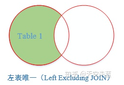

# learn-3

## 1.笛卡尔查询

笛卡尔查询可以让我们做到从多张表同时查询数据，其语法如下：

```sql
SELECT * FROM <表1> <表2>;
```

这种一次查询两个表数据的 sql 会得到一个二维表，以 `SELECT * FROM students, classes;` 为例，结果将会是 `students`表和`classes`表的“乘积”，即`students`表的每一行与`classes`表的每一行都两两拼在一起返回。结果集的列数是`students`表和`classes`表的列数之和，行数是`students`表和`classes`表的行数之积。

使用笛卡尔查询时要非常小心，由于结果集是目标表的行数乘积，对两个各自有100行记录的表进行笛卡尔查询将返回1万条记录，对两个各自有1万行记录的表进行笛卡尔查询将返回1亿条记录。

此外，笛卡尔查询还会造成结果集中有相同的字段名称，要解决这个问题，我们可以利用 AS 关键词来给字段设置别名。

> 注意，多表查询时，要使用 `表名.列名` 这样的方式来引用列和设置别名，这样就避免了结果集的列名重复问题。但是，用 `表名.列名` 这种方式列举两个表的所有列实在是很麻烦，所以SQL还允许给表设置一个别名，让我们在投影查询中引用起来稍微简洁一点。
>
> ```sql
> SELECT
>     s.id AS sid,
>     s.name,
>     s.gender,
>     s.score,
>     c.id AS cid,
>     c.name AS cname
> FROM students AS s, classes AS c
> WHERE s.gender = 'M' AND c.id = 1;
> ```

笛卡尔查询的主要缺点是**它会产生大量的数据**，而且很少有实际应用场景需要返回这么多的数据。这会导致查询速度变慢，增加网络传输和存储成本。另一个缺点是**笛卡尔积查询可能会错误地组合行，因为没有指定连接条件**。例如，如果表 A 包含城市和州的数据，表 B 包含城市和国家的数据，那么在没有连接条件的情况下，笛卡尔积查询将返回所有可能的行组合，包括一些不正确的行。

在实际应用中，**应该尽可能避免使用笛卡尔积查询，而是使用连接操作**（如 inner join、left join、right join 或 outer join）来将表中的数据组合在一起，以获得更准确和有意义的结果。

## 2.连接查询

连接查询是另一种类型的多表查询。连接查询对多个表进行JOIN运算，简单地说，就是先确定一个主表作为结果集，然后，把其他表的行有选择性地“连接”在主表结果集上。

例如，我们想要选出`students`表的所有学生信息，但是又希望结果集同时包含所在班级的名称。已知存放班级名称的`name`列存储在`classes`表中，那么只有根据`students`表的`class_id`，找到`classes`表对应的行，再取出`name`列，就可以获得班级名称。

这时我们可以采用 INNER JOIN——内连接实现这一目的：

```sql
SELECT s.id, s.name, s.class_id, c.name class_name, s.gender, s.score
FROM students s
INNER JOIN classes c
ON s.class_id = c.id;
```

INNER JOIN 查询的写法如下：

1. 先确定主表，仍然使用 `FROM <表1>` 的语法；
2. 再确定需要连接的表，使用 `INNER JOIN <表2>` 的语法；
3. 然后确定连接条件，使用`ON <条件...>`，这里的条件是`s.class_id = c.id`，表示`students`表的`class_id`列与`classes`表的`id`列相同的行需要连接；
4. 可选：加上`WHERE`子句、`ORDER BY`等子句。

使用别名不是必须的，但可以更好地简化查询语句。

> 除了内连接外，还有外连接、左连接以及右连接，下面会有介绍。

# 附录

## 1.连接查询各种用法总结

假设有学生信息表、专业班级表如下：


### 1.1.内连接

这是最常用的，获取两个表中指定字段满足匹配关系的记录。


内连接通常有两种情况：

**等值连接：**查找两个表中连接字段相等的记录，语法如下：

```sql
--查询每个学生的学号、姓名、籍贯、年龄、专业、班级
--涉及到student和major两张表，用共有字段“学号”为连接字段

--写法1：使用INNER JOIN
SELECT A.学号, A.姓名, A.籍贯, A.年龄, B.专业, B.班级
FROM student A
INNER JOIN major B   
ON  A.学号=B.学号

--写法2：--省去了INNER，直接写JOIN，与INNER JOIN没有区别
SELECT A.学号, A.姓名, A.籍贯, A.年龄, B.专业, B.班级
FROM student A
JOIN major B  
ON  A.学号=B.学号

--写法3： --使用WHERE，已经逐渐被淘汰
SELECT A.学号, A.姓名, A.籍贯, A.年龄, B.专业, B.班级
FROM student A, major B
WHERE A.学号=B.学号 
```


> INNER JOIN 相比于左、右及外连接，会排除所有带 NULL 值的行，而左、右及外连接则会有相应的全盘接受条件。

**自身连接：**就是和自己进行连接查询，给一张表取两个不同的别名，然后附上连接条件。

```sql
--要在学生表里查询与 HH 同龄且籍贯也相同的学生信息

SELECT B.学号, B.姓名, B.性别, B.籍贯, B.年龄
FROM student A 
JOIN student B
ON A.年龄=B.年龄 AND A.籍贯=B.籍贯 AND A.姓名='HH'
```


### 1.2.左连接

获取左表中的所有记录，即使在右表没有对应匹配的记录。

> 需要注意的是，FROM 后面跟着的是左表，JOIN 后面跟着的是右表。


```sql
--左连接：显示左表student所有记录，如右表中没有与之
--匹配的项则以NULL值代替。

SELECT A.学号, A.姓名, A.籍贯, A.年龄, B.专业, B.班级
FROM student A LEFT JOIN major B  
ON  A.学号=B.学号
```


### 1.3.右连接

用于获取右表中的所有记录，即使左表没有对应匹配的记录。


```sql
--右连接：显示右表major所有记录，如左表中没有与之
--匹配的项则以NULL值代替。

SELECT A.学号, A.姓名, A.籍贯, A.年龄, B.专业, B.班级
FROM student A RIGHT JOIN major B  
ON  A.学号=B.学号
```


### 1.4.完全连接

返回两个表中的所有行。


```sql
--完全连接：显示两张表的并集，如果其中一张表的记录
--在另一张表中没有匹配的行，则对应的数据项填充NULL

SELECT A.学号, A.姓名, A.籍贯, A.年龄, B.专业, B.班级
FROM student A FULL JOIN major B  
ON  A.学号=B.学号
```


### 1.5.交叉连接

结果是笛卡尔查询，就是第一个表的行数乘以第二个表的行数。


```sql
--交叉连接：一张表中的数据依次取出分别与另一张表中的
--每条数据挨个组合，最后记录数量为两张表记录数的乘积

SELECT * FROM student CROSS JOIN major

--本例student和major都为7条记录，所以结果为7*7=49条记录
```


### 1.6.扩展：左表唯一

返回左表有但右表没有关联数据的记录。



```sql
--左表唯一：将右表B以及两张表交集的部分过滤掉，
--得到的记录是左表中唯一存在的。

SELECT A.学号, A.姓名, A.籍贯, A.年龄, B.专业, B.班级
FROM student A LEFT JOIN major B
ON  A.学号=B.学号
WHERE B.学号 IS NULL
```


> `JOIN ON` 和 `WHERE` 的书写顺序与执行顺序分别是什么？
>
> 一般情况下，`where` 子句应该出现在 `JOIN ON` 子句之后，对于 sql 语句 `select * form tab1 left join tab2 on (tab1.size = tab2.size) where tab2.name="AAA"`，他俩的执行流程如下所示：
>
> 

### 1.7.扩展：右表唯一

返回右表有但左表没有关联数据的记录。


```sql
--右表唯一：将左表A以及两张表交集的部分过滤掉，
--得到的记录是右表中唯一存在的。

SELECT A.学号, A.姓名, A.籍贯, A.年龄, B.专业, B.班级
FROM student A RIGHT JOIN major B  
ON  A.学号=B.学号
WHERE A.学号 IS NULL
```


### 1.8.非交叉连接

返回左表和右表里没有相互关联的记录。


```sql
--非交集连接：查找两张表中没有关联的记录项。

SELECT A.学号, A.姓名, A.籍贯, A.年龄, B.专业, B.班级
FROM student A FULL JOIN major B  
ON  A.学号=B.学号
WHERE A.学号 IS NULL OR B.学号 IS NULL
```


