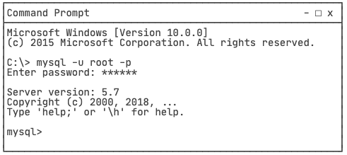
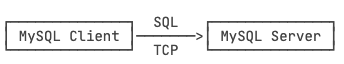

# learn-4

关系数据库的基本操作就是增删改查，即CRUD：Create、Retrieve、Update、Delete。其中，对于查询，我们已经详细讲述了`SELECT`语句的详细用法。

而对于增、删、改，对应的SQL语句分别是：

- INSERT：插入新记录；
- UPDATE：更新已有记录；
- DELETE：删除已有记录。

## 1.修改数据

### 1.1.INSERT

当我们需要向数据库表中插入一条新记录时，就必须使用`INSERT`语句。`INSERT`语句的基本语法如下：

```sql
INSERT INTO <表名> (字段1, 字段2, ...) VALUES (值1, 值2, ...);
```

在向表中插入字段时，我们可以不插入主键字段 `id`，这是因为一般情况下，`id`字段是一个自增主键，它的值可以由数据库自己推算出来。此外，如果一个字段有默认值，那么在`INSERT`语句中也可以不出现。

> 要注意，字段顺序不必和数据库表的字段顺序一致，但值的顺序必须和字段顺序一致。也就是说，可以写`INSERT INTO students (score, gender, name, class_id) ...`，但是对应的`VALUES`就得变成`(80, 'M', '大牛', 2)`。

还可以一次性添加多条记录，只需要在`VALUES`子句中指定多个记录值，每个记录是由`(...)`包含的一组值，如下所示：

```sql
INSERT INTO students (class_id, name, gender, score) VALUES
  (1, '大宝', 'M', 87),
  (2, '二宝', 'M', 81);
```

### 1.2.UPDATE

如果要更新数据库表中的记录，我们就必须使用`UPDATE`语句。`UPDATE`语句的基本语法如下：

```sql
UPDATE <表名> SET 字段1=值1, 字段2=值2, ... WHERE ...;
```

例如，我们想更新`students`表`id=1`的记录的`name`和`score`这两个字段，先写出`UPDATE students SET name='大牛', score=66`，然后在`WHERE`子句中写出需要更新的行的筛选条件`id=1`：

```sql
UPDATE students SET name='大牛', score=66 WHERE id=1;
```

注意到`UPDATE`语句的`WHERE`条件和`SELECT`语句的`WHERE`条件其实是一样的，因此完全可以一次更新多条记录：

```sql
UPDATE students SET name='小牛', score=77 WHERE id>=5 AND id<=7;
```

另外，在`UPDATE`语句中，更新字段时可以使用表达式。例如，把所有80分以下的同学的成绩加10分：

```sql
UPDATE students SET score=score+10 WHERE score<80;
```

其中，`SET score=score+10`就是给当前行的`score`字段的值加上了10。

> 如果`WHERE`条件没有匹配到任何记录，`UPDATE`语句不会报错，也不会有任何记录被更新。

最后，要特别小心的是，`UPDATE`语句可以没有`WHERE`条件，例如：

```sql
UPDATE students SET score=60;
```

这时，整个表的所有记录都会被更新。所以，在执行`UPDATE`语句时要非常小心，最好先用`SELECT`语句来测试`WHERE`条件是否筛选出了期望的记录集，然后再用`UPDATE`更新。

> 另外，在使用MySQL这类真正的关系数据库时，`UPDATE`语句会返回更新的行数以及`WHERE`条件匹配的行数。

### 1.3.DELETE

如果要删除数据库表中的记录，我们可以使用`DELETE`语句。`DELETE` 语句的基本语法是：

```sql
DELETE FROM <表名> WHERE ...;
```

例如，我们想删除`students`表中`id=1`的记录，就需要这么写：

```sql
DELETE FROM students WHERE id=1;
```

注意到`DELETE`语句的`WHERE`条件也是用来筛选需要删除的行，因此和`UPDATE`类似，`DELETE`语句也可以一次删除多条记录：

```sql
DELETE FROM students WHERE id>=5 AND id<=7;
```

> 如果`WHERE`条件没有匹配到任何记录，`DELETE`语句不会报错，也不会有任何记录被删除。

最后，要特别小心的是，和`UPDATE`类似，不带`WHERE`条件的`DELETE`语句会删除整个表的数据：

```sql
DELETE FROM students;
```

这时，整个表的所有记录都会被删除。所以，在执行`DELETE`语句时也要非常小心，最好先用`SELECT`语句来测试`WHERE`条件是否筛选出了期望的记录集，然后再用`DELETE`删除。

>在使用MySQL这类真正的关系数据库时，`DELETE`语句也会返回删除的行数以及`WHERE`条件匹配的行数。

## 2.MySQL

安装完MySQL后，除了MySQL Server，即真正的MySQL服务器外，还附赠一个MySQL Client程序。MySQL Client是一个命令行客户端，可以通过MySQL Client登录MySQL，然后，输入SQL语句并执行。

打开命令提示符，输入命令`mysql -u root -p`，提示输入口令。填入MySQL的root口令，如果正确，就连上了MySQL Server，同时提示符变为 `mysql>`：



输入`exit`断开与MySQL Server的连接并返回到命令提示符。

> MySQL Client的可执行程序是mysql，MySQL Server的可执行程序是mysqld。

MySQL Client和MySQL Server的关系如下：



在MySQL Client中输入的SQL语句通过TCP连接发送到MySQL Server。默认端口号是3306，即如果发送到本机MySQL Server，地址就是`127.0.0.1:3306`。

> 也可以只安装MySQL Client，然后连接到远程MySQL Server。假设远程MySQL Server的IP地址是`10.0.1.99`，那么就使用`-h`指定IP或域名：
>
> ```bash
> $ mysql -h 10.0.1.99 -u root -p
> ```

命令行程序`mysql`实际上是MySQL客户端，真正的MySQL服务器程序是`mysqld`，在后台运行。

### 2.1.管理 MySQL

要管理MySQL，可以使用客户端，例如命令行客户端 MySQL Client 或者图形客户端 MySQL Workbench，他们本质上都是通过 SQL 命令与 MySQL 进行交互的。

本章主要讲解了如何使用 SQL 语句管理 MySQL，此处只列出命令，不再赘述：

* show databases;
* create database test;
* drop database test;
* use test;
* show tables;
* desc students;
* show create table students;
* drop table students;
* alter table students add column birth varchar(10) not null;
* alter table students change column birth birthday varchar(20) not null;
* alter table students drop column birthday;
* exit;

参考文章：https://www.liaoxuefeng.com/wiki/1177760294764384/1246617774585536

### 2.2.实用 SQL 语句

在编写SQL时，灵活运用一些技巧，可以大大简化程序逻辑。

* **插入或者替换**：如果我们希望插入一条新记录（INSERT），但如果记录已经存在，就先删除原记录，再插入新记录。此时，可以使用`REPLACE`语句，这样就不必先查询，再决定是否先删除再插入 =>

  ```sql
  REPLACE INTO students (id, class_id, name, gender, score) VALUES (1, 1, '小明', 'F', 99);
  ```

* **插入或更新**：如果我们希望插入一条新记录（INSERT），但如果记录已经存在，就更新该记录，此时，可以使用`INSERT INTO ... ON DUPLICATE KEY UPDATE ...`语句 =>

  ```sql
  INSERT INTO students (id, class_id, name, gender, score) VALUES (1, 1, '小明', 'F', 99) ON DUPLICATE KEY UPDATE name='小明', gender='F', score=99;
  ```

* **插入或忽略**：如果我们希望插入一条新记录（INSERT），但如果记录已经存在，就啥事也不干直接忽略，此时，可以使用`INSERT IGNORE INTO ...`语句 =>

  ```sql
  INSERT IGNORE INTO students (id, class_id, name, gender, score) VALUES (1, 1, '小明', 'F', 99);
  ```

* **快照**：如果想要对一个表进行快照，即复制一份当前表的数据到一个新表，可以结合`CREATE TABLE`和`SELECT` =>

  ```sql
  CREATE TABLE students_of_class1 SELECT * FROM students WHERE class_id=1;
  ```

* **写入查询结果集**：如果查询结果集需要写入到表中，可以结合`INSERT`和`SELECT`，将`SELECT`语句的结果集直接插入到指定表中 =>

  ```sql
  INSERT INTO statistics (class_id, average) SELECT class_id, AVG(score) FROM students GROUP BY class_id;
  ```

* **强制使用指定索引**：在查询的时候，数据库系统会自动分析查询语句，并选择一个最合适的索引。但是很多时候，数据库系统的查询优化器并不一定总是能使用最优索引。如果我们知道如何选择索引，可以使用`FORCE INDEX`强制查询使用指定的索引 =>

  ```sql
  SELECT * FROM students FORCE INDEX (idx_class_id) WHERE class_id = 1 ORDER BY id DESC;
  ```


