# learn-5

在执行SQL语句的时候，某些业务要求，一系列操作必须全部执行，而不能仅执行一部分。例如，一个转账操作：

```sql
-- 从id=1的账户给id=2的账户转账100元
-- 第一步：将id=1的A账户余额减去100
UPDATE accounts SET balance = balance - 100 WHERE id = 1;
-- 第二步：将id=2的B账户余额加上100
UPDATE accounts SET balance = balance + 100 WHERE id = 2;
```

这两条SQL语句必须全部执行，或者，由于某些原因，如果第一条语句成功，第二条语句失败，就必须全部撤销。

**这种把多条语句作为一个整体进行操作的功能，被称为数据库事务**。数据库事务可以确保该事务范围内的所有操作都可以全部成功或者全部失败。如果事务失败，那么效果就和没有执行这些SQL一样，不会对数据库数据有任何改动。

可见，数据库事务具有 ACID 这 4 个特性：

* A：Atomic，原子性，将所有SQL作为原子工作单元执行，要么全部执行，要么全部不执行。
* C：Consistent，一致性，事务完成后，所有数据的状态都是一致的，即A账户只要减去了100，B账户则必定加上了100。
* I：Isolation，隔离性，如果有多个事务并发执行，每个事务作出的修改必须与其他事务隔离。
* D：Duration，持久性，即事务完成后，对数据库数据的修改被持久化存储。

对于单条SQL语句，数据库系统自动将其作为一个事务执行，这种事务被称为隐式事务。要手动把多条SQL语句作为一个事务执行，使用`BEGIN`开启一个事务，使用`COMMIT`提交一个事务，这种事务被称为显式事务，例如，把上述的转账操作作为一个显式事务：

```sql
BEGIN;
UPDATE accounts SET balance = balance - 100 WHERE id = 1;
UPDATE accounts SET balance = balance + 100 WHERE id = 2;
COMMIT;
```

很显然多条SQL语句要想作为一个事务执行，就必须使用显式事务。`COMMIT`是指提交事务，即试图把事务内的所有SQL所做的修改永久保存。如果`COMMIT`语句执行失败了，整个事务也会失败。有些时候，我们希望主动让事务失败，这时，可以用`ROLLBACK`回滚事务，整个事务会失败。

```sql
BEGIN;
UPDATE accounts SET balance = balance - 100 WHERE id = 1;
UPDATE accounts SET balance = balance + 100 WHERE id = 2;
ROLLBACK;
```

> **数据库事务是由数据库系统保证的**，我们只需要根据业务逻辑使用它就可以。

对于两个并发执行的事务，如果涉及到操作同一条记录的时候，可能会发生问题。因为并发操作会带来数据的不一致性，包括脏读、不可重复读、幻读等。数据库系统提供了隔离级别来让我们有针对性地选择事务的隔离级别，避免数据不一致的问题。

SQL标准定义了4种隔离级别，分别对应可能出现的数据不一致的情况：

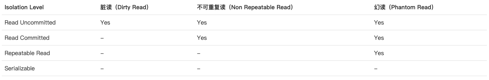

> 为了解决事务并发的问题，SQL 标准制定了事务隔离级别。它们是通过加锁实现的，锁类型有全局锁、表级锁和行级锁。

## 1.Read Uncommitted（读未提交）

Read Uncommitted是隔离级别最低的一种事务级别。在这种隔离级别下，一个事务会读到另一个事务更新后但未提交的数据，如果另一个事务回滚，**那么当前事务读到的数据就是脏数据，这就是脏读（Dirty Read）**。

我们来看一个例子。首先，我们准备好 `students` 表的数据，该表仅一行记录：

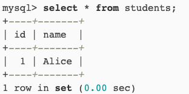

然后，分别开启两个 MySQL 客户端连接，按顺序依次执行事务A和事务B：

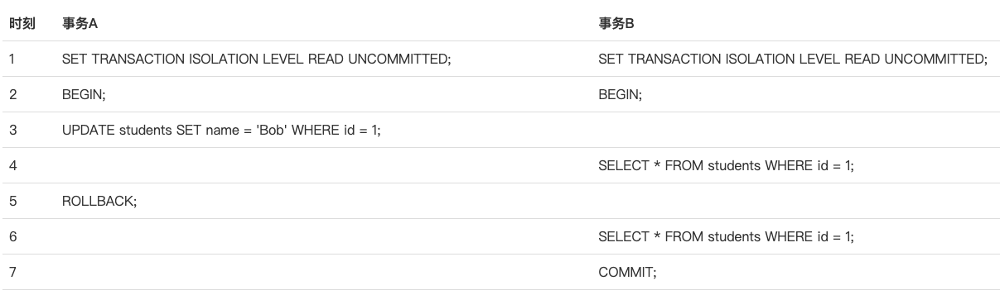

当事务A执行完第3步时，它更新了`id=1`的记录，但并未提交，而事务B在第4步读取到的数据就是未提交的数据。随后，事务A在第5步进行了回滚，事务B再次读取`id=1`的记录，发现和上一次读取到的数据不一致，这就是脏读。可见，在Read Uncommitted隔离级别下，一个事务可能读取到另一个事务更新但未提交的数据，这个数据有可能是脏数据。

## 2.Read Committed（读已提交）

在Read Committed隔离级别下，一个事务可能会遇到不可重复读（Non Repeatable Read）的问题。不可重复读是指，在一个事务内，多次读同一数据，在这个事务还没有结束时，如果另一个事务恰好修改了这个数据，那么，在第一个事务中，两次读取的数据就可能不一致。

我们仍然先准备好`students`表的数据：

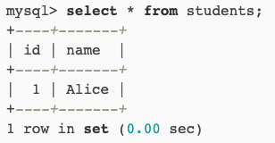

然后，分别开启两个MySQL客户端连接，按顺序依次执行事务A和事务B：

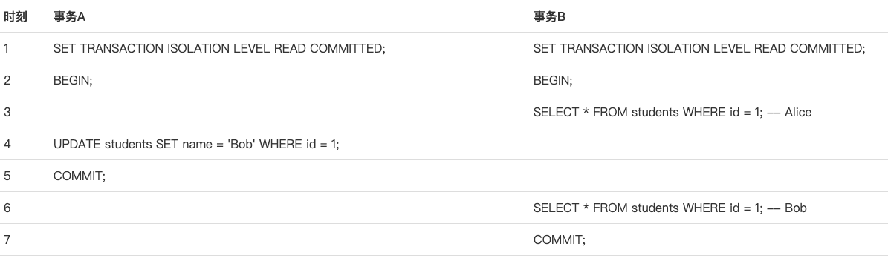

当事务B第一次执行第3步的查询时，得到的结果是`Alice`，随后，由于事务A在第4步更新了这条记录并提交，所以，事务B在第6步再次执行同样的查询时，得到的结果就变成了`Bob`，因此，在Read Committed隔离级别下，事务不可重复读同一条记录，因为很可能读到的结果不一致。

## 3.Repeatable Read（可重复读）

在Repeatable Read隔离级别下，一个事务可能会遇到幻读（Phantom Read）的问题。幻读是指，在一个事务中，第一次查询某条记录，发现没有，但是，当试图更新这条不存在的记录时，竟然能成功，并且，再次读取同一条记录，它就神奇地出现了。

我们仍然先准备好`students`表的数据：

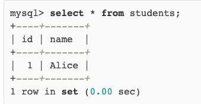

然后，分别开启两个MySQL客户端连接，按顺序依次执行事务A和事务B：

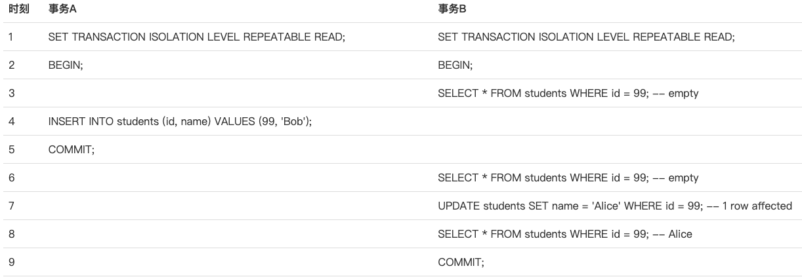

事务B在第3步第一次读取`id=99`的记录时，读到的记录为空，说明不存在`id=99`的记录。随后，事务A在第4步插入了一条`id=99`的记录并提交。事务B在第6步再次读取`id=99`的记录时，读到的记录仍然为空，但是，事务B在第7步试图更新这条不存在的记录时，竟然成功了，并且，事务B在第8步再次读取`id=99`的记录时，记录出现了。

**可见，幻读就是没有读到的记录，以为不存在，但其实是可以更新成功的，并且，更新成功后，再次读取，就出现了。**

> 此处涉及快照读和当前读的知识，**在默认隔离级别下，select 语句默认是快照读**，此处不再展开。
>
> * 参考文章 I：https://www.cnblogs.com/silyvin/p/9106668.html。
> * 参考文章 II：https://juejin.cn/post/7001357238648438821。

## 4.Serializable（序列化）

Serializable是最严格的隔离级别。在Serializable隔离级别下，所有事务按照次序依次执行，因此，脏读、不可重复读、幻读都不会出现。

虽然Serializable隔离级别下的事务具有最高的安全性，但是，由于事务是串行执行，所以效率会大大下降，应用程序的性能会急剧降低。如果没有特别重要的情景，一般都不会使用Serializable隔离级别。

>如果没有指定隔离级别，数据库就会使用默认的隔离级别。在MySQL中，如果使用InnoDB，默认的隔离级别是Repeatable Read。

# 附录

## 1.数据的不一致性

数据的不一致性包括了脏读、不可重复读和幻读，下面是相应的解释：

**脏读**：脏读指的是读到了其他事务未提交的数据，未提交意味着这些数据可能会回滚，也就是可能最终不会存到数据库中，也就是不存在的数据。读到了最终不一定存在的数据**并开始使用它**，这就是脏读。

**不可重复读（针对一行数据的 select，更加侧重读-读）**：不可重复读指的是在同一事务内，不同的时刻读到的同一批数据可能是不一样的，可能会受到其他事务的影响，比如其他事务改了这批数据并提交了。通常针对数据**更新（UPDATE）**操作。

**幻读（针对一批数据的 select，更加侧重读-写）**：幻读是针对数据**插入（INSERT）和删除（DELETE）**操作来说的。假设事务A对某些行的内容作了更改，但是还未提交，此时事务B插入了与事务A更改前的记录相同的记录行，并且在事务A提交之前先提交了，而这时，在事务A中查询，会发现好像刚刚的更改对于某些数据未起作用，但其实是事务B刚插入进来的，让用户感觉很魔幻，感觉出现了幻觉，这就叫幻读。

## 2.事务的隔离级别

SQL 标准定义了四种隔离级别，MySQL 全都支持。这四种隔离级别分别是：

* 读未提交（READ UNCOMMITTED）
* 读提交 （READ COMMITTED）
* 可重复读 （REPEATABLE READ）
* 串行化 （SERIALIZABLE）

从上往下，隔离强度逐渐增强，性能逐渐变差。采用哪种隔离级别要根据系统需求权衡决定，其中，**可重复读**是 MySQL 的默认级别。事务隔离其实就是为了解决上面提到的脏读、不可重复读、幻读这几个问题，下面展示了 4 种隔离级别对这三个问题的解决程度。

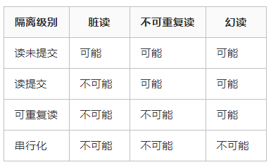

只有串行化的隔离级别解决了全部这 3 个问题，其他的 3 个隔离级别都有缺陷。

### 2.1.分析前的预设

以一张表为例：

```sql
CREATE TABLE `user` (
  `id` int(11) NOT NULL AUTO_INCREMENT,
  `name` varchar(30) DEFAULT NULL,
  `age` tinyint(4) DEFAULT NULL,
  PRIMARY KEY (`id`)
) ENGINE=InnoDB AUTO_INCREMENT=2 DEFAULT CHARSET=utf8
```

初始时只有一条记录：

```bash
mysql> SELECT * FROM user;
+----+-----------------+------+
| id | name            | age  |
+----+-----------------+------+
|  1 | 古时的风筝        |    1 |
+----+-----------------+------+
```

### 2.2.读未提交

MySQL 事务隔离其实是依靠锁来实现的，加锁自然会带来性能的损失。而读未提交隔离级别是不加锁的，所以它的性能是最好的，没有加锁、解锁带来的性能开销。但有利就有弊，这基本上就相当于裸奔啊，所以它连脏读的问题都没办法解决。

> 任何事务对数据的修改都会第一时间暴露给其他事务，即使事务还没有提交。

启动两个事务，分别为事务A和事务B，在事务A中使用 update 语句，修改 age 的值为10，初始是1 ，在执行完 update 语句之后，在事务B中查询 user 表，会看到 age 的值已经是 10 了，这时候事务A还没有提交，而此时事务B有可能拿着已经修改过的 age=10 去进行其他操作了。在事务B进行操作的过程中，很有可能事务A由于某些原因，进行了事务回滚操作，那其实事务B得到的就是脏数据了，拿着脏数据去进行其他的计算，那结果肯定也是有问题的。

顺着时间轴往表示两事务中操作的执行顺序，重点看图中 age 字段的值。

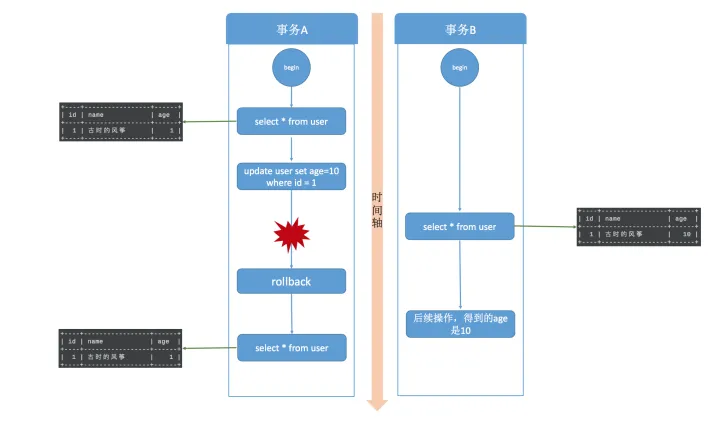

读未提交，其实就是可以读到其他事务未提交的数据，但没有办法保证你读到的数据最终一定是提交后的数据，如果中间发生回滚，那就会出现脏数据问题，**读未提交没办法解决脏数据问题。更别提可重复读和幻读了**。

### 2.3.读已提交

既然读未提交没办法解决脏数据问题，那么就有了读提交。**读提交就是一个事务只能读到其他事务已经提交过的数据，也就是其他事务调用 commit 命令之后的数据**。那脏数据问题迎刃而解了。

> 读提交事务隔离级别是大多数流行数据库的默认事务隔离界别，比如 Oracle，但是不是 MySQL 的默认隔离界别。

同样开启事务A和事务B两个事务，在事务A中使用 update 语句将 id=1 的记录行 age 字段改为 10。此时，在事务B中使用 select 语句进行查询，我们发现在事务A提交之前，事务B中查询到的记录 age 一直是1，直到事务A提交，此时在事务B中 select 查询，发现 age 的值已经是 10 了。

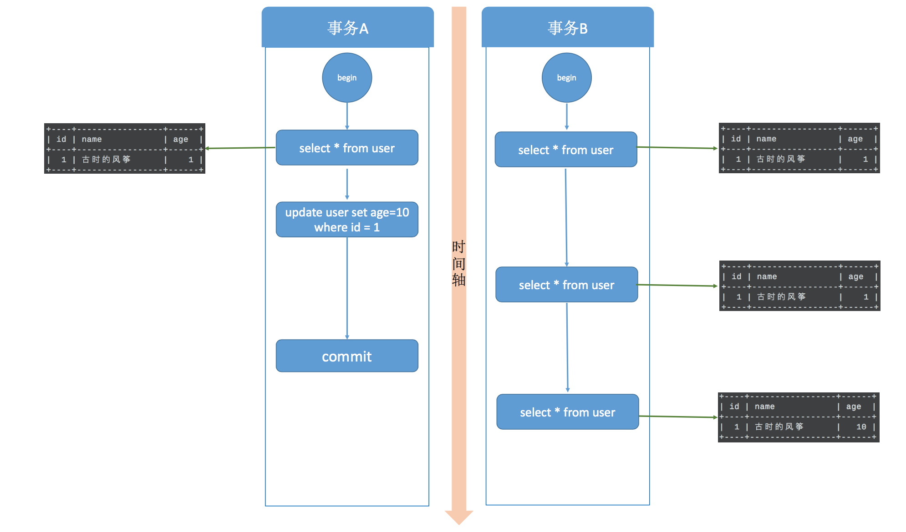

这就出现了一个问题，在同一事务中(本例中的事务B)，**事务的不同时刻同样的查询条件，查询出来的记录内容是不一样的**，事务A的提交影响了事务B的查询结果，这就是不可重复读，也就是读提交隔离级别。

> 如果事务隔离级别是读未提交，那么事务 B 在以上流程中 select 出来的数据分别是 1，10，10，因为事务 A update 的数据也能被事务 B 读取到。

读已提交解决了脏读的问题，但是无法做到可重复读，也没办法解决幻读。

### 2.4.可重复读

可重复是对比不可重复而言的，上面说不可重复读是指同一事物不同时刻读到的数据值可能不一致。而可重复读是指，**事务不会读到其他事务对已有数据的修改，即使其他事务已提交，也就是说，事务开始时读到的已有数据是什么，在事务提交前的任意时刻，这些数据的值都是一样的。**但是，对于其他事务新插入的数据是可以读到的，这也就引发了幻读问题。

> 可重复读的本质是我的事务不会受到其他事务的影响。

首先看一下可重复读的效果，事务A启动后修改了数据，并且在事务B之前提交，事务B在事务开始和事务A提交之后两个时间节点都读取的数据相同，已经可以看出可重复读的效果。

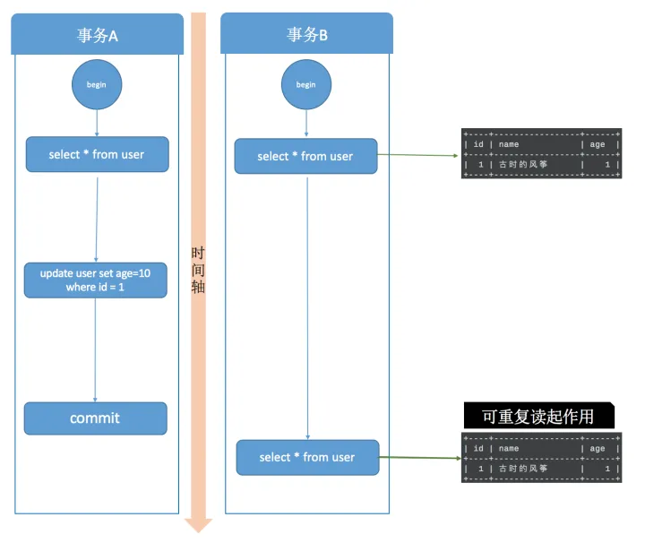

可重复读做到了，**这只是针对已有行的更改操作有效，但是对于新插入的行记录，就没这么幸运了，幻读就这么产生了**。我们看一下这个过程：

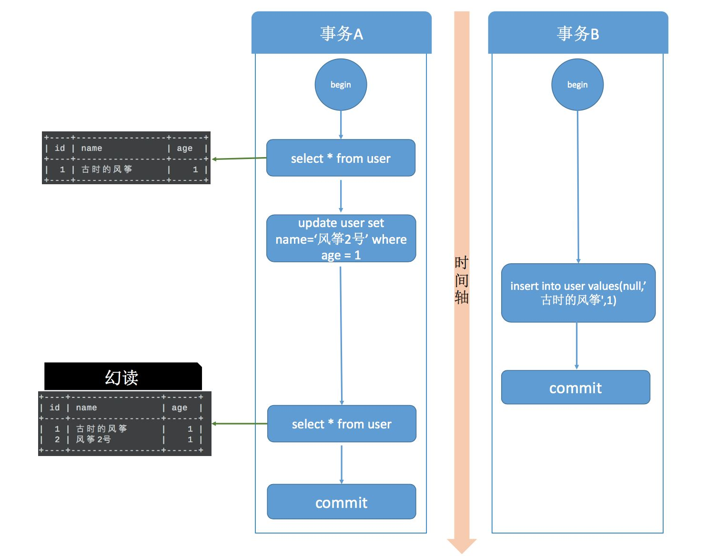

事务A开始后，执行 update 操作，将 age = 1 的记录的 name 改为“风筝2号”。

事务B开始后，在事务执行完 update 后，执行 insert 操作，插入记录 age =1，name = 古时的风筝，这和事务A修改的那条记录值相同，然后提交。

事务B提交后，事务A中执行 select，查询 age=1 的数据，这时，会发现多了一行，并且发现还有一条 name = 古时的风筝，age = 1 的记录，这其实就是事务B刚刚插入的，这就是幻读。

> 幻读本质上就是前后多次读取，但是数据总量不一致。
>
> 但也有说，mysql 的幻读并非什么读取两次返回结果集不同，而是事务在插入事先检测不存在的记录时，惊奇的发现这些数据已经存在了，之前的检测读获取到的数据如同鬼影一般。
>
> 不可重复读侧重表达 读-读，幻读则是说 读-写，用写来证实读的是鬼影。

**要说明的是，当我们在 MySQL 中测试幻读的时候，并不会出现上图的结果，幻读并没有发生，MySQL 的可重复读隔离级别其实解决了幻读问题**。因为 MySQL 把行锁和间隙锁合并在一起，解决了并发写和幻读的问题，这个锁叫做 Next-Key锁。

### 2.5.串行化

串行化是 4 种事务隔离级别中隔离效果最好的，解决了脏读、可重复读、幻读的问题，但是效果最差，它将事务的执行变为顺序执行，与其他三个隔离级别相比，它就相当于单线程，后一个事务的执行必须等待前一个事务结束。

## 3.MySQL 是如何实现事务隔离的

这里设计到 MySQL 到锁机制，暂时略去。

参考文章：https://zhuanlan.zhihu.com/p/117476959。

# 附附录I：真正理解可重复读

相信会有人对可重复读行为会有较大的疑问：

1. 程序员为什么不把第一次读的数据保留在内存中，第二次重复使用不行吗？为啥要数据库保证两次读出的数据是相同的(即可重复读)，并且读两次数据库会浪费更多数据库资源而降低性能。
2. 另外，每次读出最新的数据有啥不好？读个历史数据有啥用？

我们举一个需求的例子，有个金融产品有一个功能，需要查找那些账号余额与账号交易流水对不上的用户，我们叫到账任务吧，而且要在对账任务运行时，用户交易正常不中断。

比如某账号余额100元，该账号有两笔交易记录(+200, -100)，这样这个账号就对账正常，但如果程序查询出账号余额100元后，这时用户又转出100元，我们再去查询交易记录时，在不同事务隔离级别下会查到不同的结果，如下：

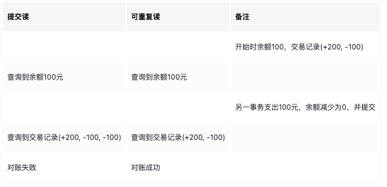

可见，在提交读场景下，对账失败了，而可重复读场景下对账成功了，而实际上这个账号的余额与交易记录始终是对齐的。所以可重复读的具体作用是什么呢？

**它本质作用是保证在开启事务后，对数据库所有表数据的查询，查询到的都是相同的版本，就是开启事务那一刻的版本**(在mysql中为第一次查询那一刻的版本)，而不管它是查询的一个表，还是不同的表，所以可重复读事务级别解决的并不是表面上的不可重复读现象。

可重复读也经常用在数据库备份过程中，由于数据库备份时数据还有可能在不断修改，我们肯定希望备份整个数据库开始时的那个版本，而不希望备份的数据有些是之前那个时刻版本的，有些则是之后那个时间版本的。

> 这个例子也说明了另一个问题，即什么时候需要使用事务，刚写代码时我们经常被告知**所有写操作要放到一个事务中**，实际上，一些特殊场景，**多个读操作也要放到一个事务中**。

因此事实上，可重复读应当被理解为**一致版本读**。


