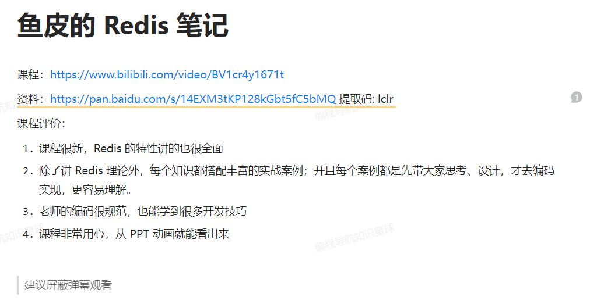
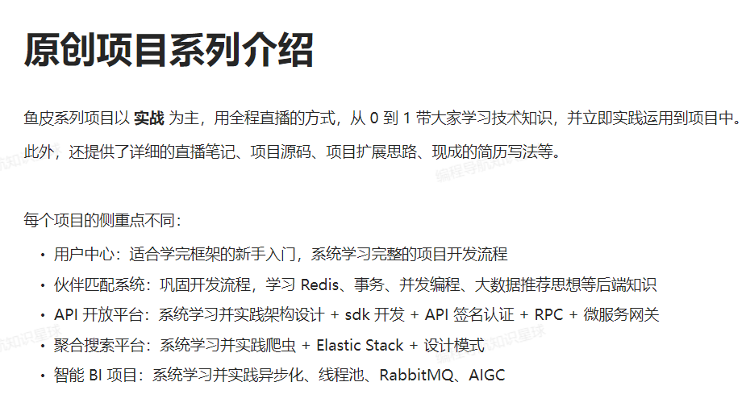
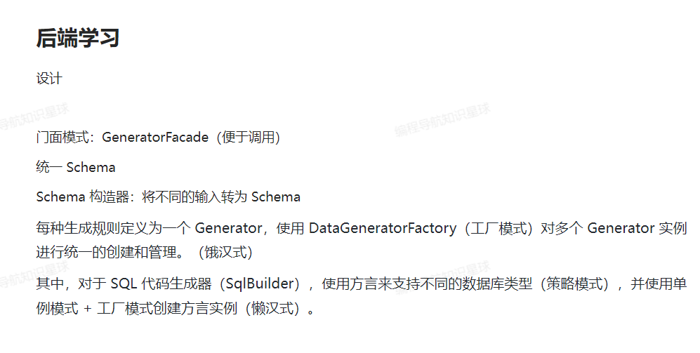
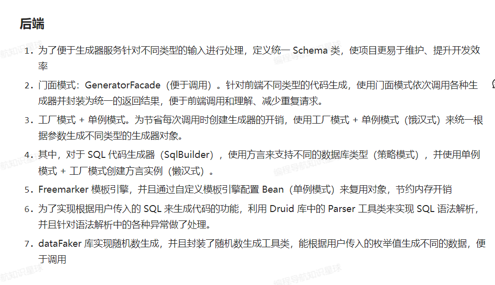
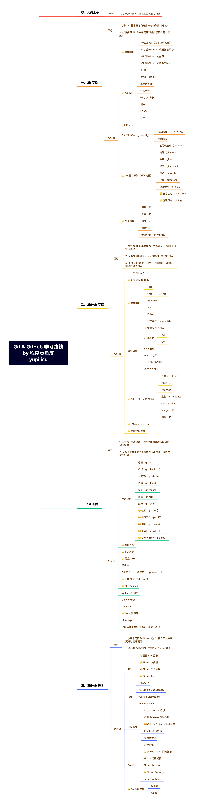
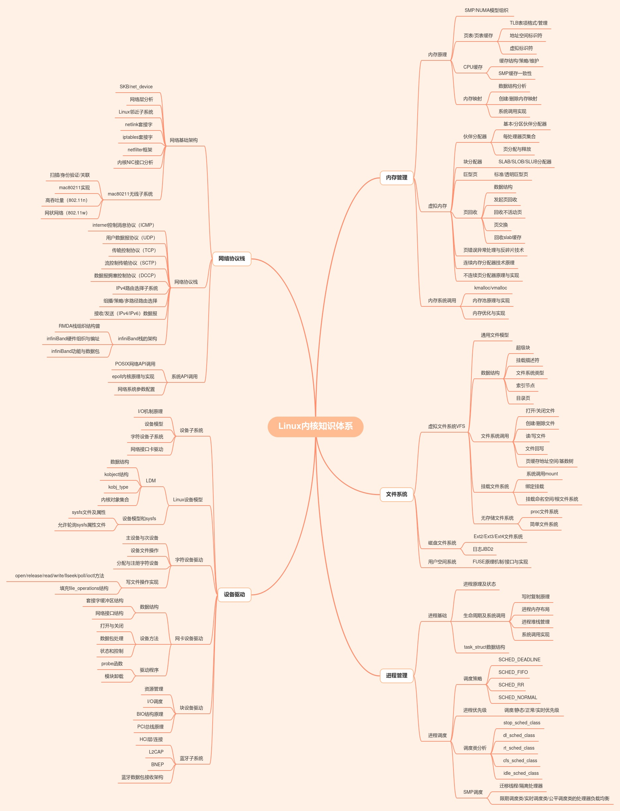
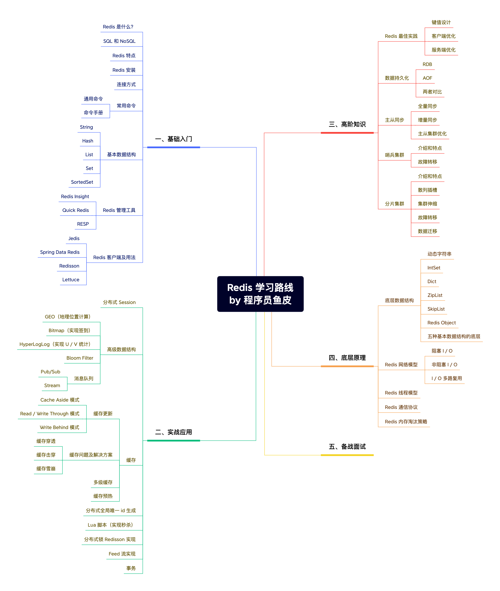

# Entry

## 1.好书推荐

* Java核心技术 卷I：开发基础（原书第12版） 
* Java 并发编程之美
* 高性能 MySQL（第 4 版）
* 图解 HTTP
* 大话设计模式
* 漫画算法：小灰的算法之旅
* 剑指Offer（专项突破版）：数据结构与算法名企面试题精讲
* Go 语言极简一本通
* 动手学深度学习（PyTorch版）
* MySQL 是怎么样运行的
* 高性能 MySQL

## 2.Redis

## 3.原创项目介绍

## 4.SQL 之父

## 5.Git & Github 学习路线

## 6.Linux 学习路线

## 7.Redis 学习路线

* 基础入门
  * Redis 是什么
  * SQL 和 NoSQL
  * Redis 的特点
  * Redis 的安装
  * 连接方式
  * 常用命令
    * 通用命令
    * 命令手册
  * 基本数据结构
    * String
    * Hash
    * List
    * Set
    * SortedSet
  * Redis 管理工具
    * Redis Insight
    * Quick Redis
    * RESP
  * Redis 客户端及用法
    * Jedis
    * Spring Data Redis
    * Redisson
    * Lettuce
* 实战应用
  * 分布式 Session
  * 高级数据结构
    * GEO（地理位置计算）
    * Bitmap（实现签到）
    * HyperLogLog（实现 U/V 统计）
    * Bloom Filter
    * 消息队列
      * Pub/Sub
      * Stream
  * 缓存
    * 缓存更新
      * Cache Aside 模式
      * Read / Write Through 模式
      * Write Behind 模式
    * 缓存问题及解决方案
      * 缓存穿透
      * 缓存击穿
      * 缓存雪崩
    * 多级缓存
    * 缓存预热
  * 分布式全局唯一 id 生成
  * Lua 脚本（实现秒杀）
  * 分布式锁 Redisson 的实现
  * Feed 流的实现
  * 事务
* 高阶知识
  * Redis 最佳实践
    * 键值设计
    * 客户端优化
    * 服务端优化
  * 数据持久化
    * RDB
    * AOF
    * 两者对比
  * 主从同步
    * 全量同步
    * 增量同步
    * 主从集群优化
  * 哨兵集群
    * 介绍和特点
    * 故障转移
  * 分片集群
    * 介绍和特点
    * 散列插槽
    * 集群伸缩
    * 故障转移
    * 数据迁移
* 底层原理
  * 底层数据结构
    * 动态字符串
    * IntSet
    * Dict
    * ZipList
    * SkipList
    * Redis Object
    * 五种基本数据结构的底层
  * Redis 网络模型
    * 阻塞 IO
    * 非阻塞 IO
    * IO 多路复用
  * Redis 线程模型
  * Redis 通信协议
  * Redis 内存淘汰策略

Redis 学习的入门教程可以参考视频 https://www.bilibili.com/video/BV1cr4y1671t/，几乎包括了 Redis 所有的入门知识和主流应用，还有高级用法和原理的讲解。

## 8.MySQL 学习

> 数据库分为关系型数据库和非关系型数据库，前者适用于存储相互之间有关联的数据，而后者则是主要存储零散的、相互独立的数据。

对数据库的学习主要包括四个部分：

1. 数据库的理论。
2. MySQL 的入门及实践。
3. SQL 语句。
4. MySQL 高级（原理）。

> 一般来说掌握前三点即可。

### 8.1.数据库的理论

下面给出数据库的一些知识点：

* 数据库基本概念
  * 数据库
    * 关系型数据库
    * 非关系型数据库
  * 数据库管理系统
  * 表
  * 字段
  * 视图
  * 约束
  * SQL
  * 查询
  * 索引
  * 事务
  * 主键
  * 外键
  * 语法分类
    * DDL
    * DML
    * DCL
    * DQL
* 数据库设计
  * 数据库三大范式
  * 表关联
    * 一对一
    * 一对多
    * 多对多
    * 笛卡尔积
  * E-R图

### 8.2.MySQL 入门以及实践

* MySQL 安装
* MySQL 常用命令
* MySQL 基本操作
  * 插入数据
  * 删除数据
  * 修改数据
  * 查询数据
* MySQL 关键词
* MySQL 函数
* MySQL 查询语法
  * 基本查询
  * 条件查询
  * 聚合查询
  * 分组查询
  * 连接
    * 内连接
    * 外连接
  * 子查询
  * 组合查询
* MySQL 约束
* MySQL 存储引擎
  * 游标
* MySQL 触发器
* MySQL 事务
* MySQL 索引
* MySQL 视图
* MySQL 库表设计
* 客户端操作

### 8.3.SQL 语句

* 基本概念
  * 什么是 SQL
  * 不同数据库的 SQL 差异
* 基础语法
  * 选择 select
    * select *
    * select field
    * select field as xxx
  * 排序 order by
  * 条件查询 where
    * and
    * or
    * not
    * like
    * is null / is not null
  * 去重 distinct
  * 截断 limit
  * 分页 offset
  * 分支 case when
* 分组聚合 group by
  * 单级
  * 多级
  * having 子句
* 函数
  * 时间函数
  * 字符串函数
  * 聚合函数
  * 开窗函数
    * sum over
    * sum over order
    * lag、lead
    * row number
* 关联查询
  * where
  * join
  * left join
  * right join
  * outer join
  * inner join
* 子查询
* 组合查询
  * union
  * union all

