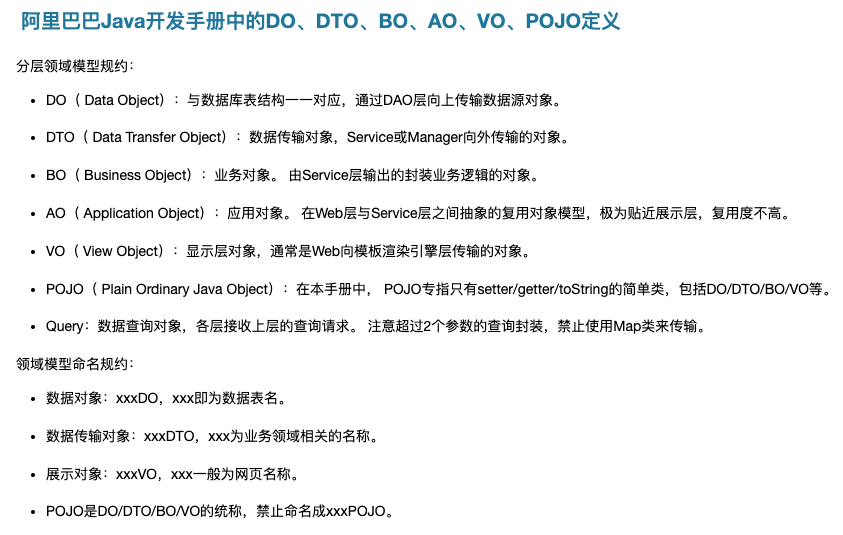

# learn-1

## 1.什么是单点登录

* 参考文章I：https://zhuanlan.zhihu.com/p/66037342
* 参考文章II：https://developer.aliyun.com/article/636281

> 上述均通过 cookie 和 session 完成了单点登录，事实上还可以通过 JWT 技术来完成。
>
> 基于session、cookie的SSO实现需要在服务器端存储session对象，而基于JWT的SSO实现则不需要在服务器端存储任何信息，因此具有更好的可扩展性和更少的服务器负载。另外，JWT可以防止CSRF攻击，而基于session cookie的SSO实现需要使用其他技术来防止CSRF攻击。

## 2.domain 与 model

domain 一般是与数据库中的列相对应的，而 model 则是更通用的模型层，之后还有 DTO、VO 之类的 model。



其实也不需要将这些信息定死，这些标准一般与公司编码规范强相关，比如上面阿里的 Java 开发手册，我们只需要知道这些以及 entity 等是一个数据实体类就行了。

## 3.MyBatisX 替我们做了什么？

MyBatisX 插件，自动根据数据库生成 domain 实体对象、mapper（操作数据库的对象）、mapper.xml（定义了 mapper对象和数据库的关联，可以在里面自己写 SQL）、service（包含常用的增删改查）、serviceImpl（具体实现 service）。

## 4.common utils

做一些简单的校验，例如 String 的校验，StringUtils.isAnyBlank()。

> 做逻辑判断的时候，能用 if 就用 if，if 完之后直接 return，减少 else 的使用。
>
> 另外，测试代码的 demo（尤其是单元测试）时可以使用 Test。

## 5.MyBatis 的优势是什么，使用 Demo 是什么？

相比于传统的 JDBC，MyBatis 的优势是什么？

1. MyBatis 通过将 SQL 语句和 Java 对象的映射关系定义在 XML 文件中，使得开发人员只需要编写 SQL 语句和 Java 对象之间的映射关系即可，极大地减少了 JDBC API 的模板代码。
2. 提供XML标签，支持编写动态SQL语句，并可重用。
3. SQL 写在 XML 里，解除 SQL 与程序代码的耦合，便于统一管理。

相比于全自动 ORM 框架 Hibernate，半自动的 ORM 框架 MyBatis 的优势是什么？

1. 直接基于SQL语句编程，相当灵活，不会对应用程序或者数据库的现有设计造成任何影响。
2. MyBatis 的 SQL 语句是直接编写在 XML 文件中的，这使得代码更加易于维护。此外，MyBatis 支持使用注解来编写 SQL 语句，这可以进一步简化代码。
3. 相对于 Hibernate，MyBatis 学习曲线更低，因为它的概念和使用方法更简单。

> 普及一些 MyBatis 的语法：
>
> * 结果映射：resultMap，用来将数据库查询结果映射到 Java 对象中，通常情况下，如果查询结果的列名与 Java 对象的属性名完全一致，那么就不需要使用 resultMap，MyBatis 会自动将结果映射到 Java 对象中。
> * 抽取可重用的 SQL 片段：`<sql>`，用于抽取可重用的 SQL 片段，将相同的，使用频繁的 SQL 片段抽取出来，单独定义，方便多次引用。

Demo 可以直接参考实例代码：https://github.com/zq2599/blog_demos/tree/master/mybatis/curd。

>优质仓库及教学博主：https://github.com/zq2599。

## 6.MyBatis-Plus 做了哪些增强，使用 Demo 是什么？

相比于 Mybatis，MyBatis-Plus 做了哪些增强？

1. 方便：MyBatis-Plus 可以帮助我们快速生成 MyBatis 的 mapper 接口以及对应的实现类，省去了手写 mapper 接口和 XML 文件的麻烦。
2. 易用：MyBatis-Plus 提供了很多通用的 CRUD 方法，如插入、更新、删除、查询等，开发者只需要调用这些方法即可完成相应的操作。
3. 强大：MyBatis-Plus 支持 Lambda 表达式查询、分页查询、主键自动生成等一系列功能。
4. 可扩展性强：MyBatis-Plus 允许用户通过自定义 MybatisSqlInjector 来扩展 SQL 语句，也允许用户自定义 Condition 类来实现复杂查询。

Demo 可以直接参考官方提供的实例代码：https://github.com/baomidou/mybatis-plus-samples/tree/master。

> MyBatis-Plus 官网为 https://baomidou.com/。
>
> 第三方教程参考：https://juejin.cn/post/7232091653065850939。

`MyBatis-Plus` 会帮助我们引入  `MyBatis` 以及 `MyBatis-Spring`，因此，引入 `MyBatis-Plus` 之后请不要再次引入 `MyBatis` 以及 `MyBatis-Spring`，以避免因版本差异导致的问题。 

## 7.Java Web Servlet 和 SpringMVC 中的 HttpServletRequest

我们要知道 SpringMVC 在 Web 部分只是对 Java Web Servlet 的封装。很多原理其实是不变的，以 HttpServletRequest 为例子，以如下代码为例：

```java
		@PostMapping("/login")
    public BaseResponse<User> userLogin(@RequestBody UserLoginRequest userLoginRequest, HttpServletRequest request) {
        if (userLoginRequest == null) {
            return ResultUtils.error(ErrorCode.PARAMS_ERROR);
        }
        String userAccount = userLoginRequest.getUserAccount();
        String userPassword = userLoginRequest.getUserPassword();
        if (StringUtils.isAnyBlank(userAccount, userPassword)) {
            return ResultUtils.error(ErrorCode.PARAMS_ERROR);
        }
        User user = userService.userLogin(userAccount, userPassword, request);
        return ResultUtils.success(user);
    }
```

这里的 HttpServletRequest 实际上就是 Java Web 中的 HttpServletRequest。而且，在 SpringMVC 中，其实每次 Web 容器都会向 Controller 方法传递 HttpServletRequest，如果形参中没有 HttpServletRequest，取而代之的是 @RequestParam、@PathVariable、@RequestHeader 等注解，那其实本质上还是传入了 HttpServletRequest，只不过 SpringMVC 做了一层封装。

>HttpServletRequest 对象通常都会被 Spring MVC 框架自动传递给控制器方法，以便在方法中对 HTTP 请求进行处理。
>
>当客户端发送一个 HTTP 请求时，Spring MVC 框架会自动创建一个包含该请求信息的 HttpServletRequest 对象，并将该对象作为参数传递给对应的控制器方法。控制器方法可以通过 HttpServletRequest 对象来获取请求信息，例如请求参数、请求头、请求体等等，并对请求进行处理。
>
>如果控制器方法中没有显式地定义 HttpServletRequest 参数，Spring MVC 框架也会尝试将 HttpServletRequest 对象中的请求参数绑定到方法的参数上，例如使用 @RequestParam、@PathVariable、@RequestHeader 等注解。因此，HttpServletRequest 对象通常都会被 Spring MVC 框架传递给控制器方法，并在方法中进行处理。
>

## 8.SpringBoot 中的 classpath 是什么

在 Java 和 Spring Boot 中，classpath 是 JVM 用来查找和加载编译后的 .class 文件的环境变量。这是 Java 编译器和运行时环境在运行时查找 Java 类的地方。

classpath 可以包括目录、ZIP 文件、JAR 文件和 WAR 文件等。这些路径中应该包含你的程序需要的所有 Java 类文件。

在 Spring Boot 中，classpath 尤其重要，因为它通常被用来引入项目依赖以及加载项目资源，如配置文件（例如 application.properties 或 application.yml）。在 Spring Boot 项目中，你可以使用 classpath: 前缀来访问 classpath 中的文件。例如，如果你有一个在 src/main/resources 目录下的名为 application.properties 的文件，你可以使用 classpath:application.properties 来引用它。

Spring Boot 默认会把以下位置加入到 `classpath` 中：

- `src/main/resources`，应用程序的资源文件，如配置文件和静态资源。
- `src/main/java`，你的应用程序的源代码。
- `target/classes`，编译后的 .class 文件。
- 项目依赖的 jar 文件。

因此，你可以把你的配置文件，静态资源文件等放在这些目录下，Spring Boot 会自动找到它们。

## 9.MyBatis-Plus 补充

### 9.1.条件构造器

条件构造器用来制定查询、删除或者更新的条件，可以将其理解为 where 子句在 MyBatis-Plus 中的映射。

参考文档：https://baomidou.com/pages/10c804/#abstractwrapper

* AbstractWrapper（QueryWrapper 和 UpdateWrapper 的父类）。
* QueryWrapper。
* UpdateWrapper。

### 9.2.CRUD 接口

参考文档：https://baomidou.com/pages/49cc81/#service-crud-%E6%8E%A5%E5%8F%A3

* Service CRUD 接口。
* Mapper CRUD 接口。

MyBatis-Plus 在 Mapper 层和 Service 层均设计了 CURD 接口，至于为什么这样设计，目前也还没有定论。一般来讲，如果我们要使用批处理操作，那么就需要用到 Service 层的 CRUD 接口，而如果要扩展对数据库的操作的话，则需要使用到 Mapper 层的 CRUD 接口（借助 MyBatis 的 xml 进行扩展）。

## 10.Java 8：函数式编程

> 函数式编程就是一种抽象程度很高的编程范式，纯粹的函数式编程语言编写的函数没有变量，因此，任意一个函数，只要输入是确定的，输出就是确定的，**这种纯函数我们称之为没有副作用**。
>
> 而允许使用变量的程序设计语言，由于函数内部的变量状态不确定，同样的输入，可能得到不同的输出，因此，这种函数是有副作用的。
>
> 函数式编程的一个特点就是，允许把函数本身作为参数传入另一个函数，还允许返回一个函数。

### 10.1.Lambda 基础

Java 的方法分为实例方法以及静态方法，无论是实例方法，还是静态方法，本质上都相当于过程式语言的函数。只不过Java的实例方法隐含地传入了一个`this`变量，即实例方法总是有一个隐含参数`this`。

函数式编程（Functional Programming）是把函数作为基本运算单元，函数可以作为变量，可以接收函数，还可以返回函数。

在Java程序中，我们经常遇到一大堆单方法接口，即一个接口只定义了一个方法：

- Comparator。
- Runnable。
- Callable。

以 `Comparator` 为例，我们想要调用 `Arrays.sort()` 时，可以传入一个 `Comparator` 实例，以匿名类方式编写如下：

```java
String[] array = ...
Arrays.sort(array, new Comparator<String>() {
    public int compare(String s1, String s2) {
        return s1.compareTo(s2);
    }
});
```

上述写法非常繁琐。从Java 8开始，我们可以用Lambda表达式替换单方法接口。改写上述代码如下：

```java
String[] array = new String[] { "Apple", "Orange", "Banana", "Lemon" };
Arrays.sort(array, (s1, s2) -> {
    return s1.compareTo(s2);
});
```

观察Lambda表达式的写法，它只需要写出方法定义：

```java
(s1, s2) -> {
    return s1.compareTo(s2);
}
```

其中，参数是`(s1, s2)`，参数类型可以省略，因为编译器可以自动推断出`String`类型。`-> { ... }`表示方法体，所有代码写在内部即可。Lambda表达式没有`class`定义，因此写法非常简洁。如果只有一行`return xxx`的代码，完全可以用更简单的写法:

```java
Arrays.sort(array, (s1, s2) -> s1.compareTo(s2));
```

返回值的类型也是由编译器自动推断的，这里推断出的返回值是`int`，因此，只要返回`int`，编译器就不会报错。

我们把只定义了单方法的接口称之为`FunctionalInterface`，用注解`@FunctionalInterface`标记。例如，`Callable`接口：

```java
@FunctionalInterface
public interface Callable<V> {
    V call() throws Exception;
}
```

Comparator 就是 `FunctionalInterface`。 

### 10.2.方法引用

使用Lambda表达式，我们就可以不必编写`FunctionalInterface`接口的实现类，从而简化代码。实际上，除了Lambda表达式，我们还可以直接传入方法引用。例如：

```java
public class Main {
    public static void main(String[] args) {
        String[] array = new String[] { "Apple", "Orange", "Banana", "Lemon" };
        Arrays.sort(array, Main::cmp);
        System.out.println(String.join(", ", array));
    }

    static int cmp(String s1, String s2) {
        return s1.compareTo(s2);
    }
}
```

上述代码在`Arrays.sort()`中直接传入了静态方法`cmp`的引用，用`Main::cmp`表示。因此，所谓方法引用，是指如果某个方法签名和接口恰好一致，就可以直接传入方法引用。因为`Comparator<String>`接口定义的方法是`int compare(String, String)`，和静态方法`int cmp(String, String)`相比，除了方法名外，方法参数一致，返回类型相同，因此，我们说两者的方法签名一致，可以直接把方法名作为Lambda表达式传入。

实例方法也可以被引用，但是使用实例方法做方法引用时，必须要考虑**隐含参数 this** 的存在，否则会出现方法签名不匹配的情况，此处不再详述。

除了可以引用静态方法和实例方法，我们还可以引用构造方法。如果要把一个`List<String>`转换为`List<Person>`，应该怎么办？传统的做法是先定义一个`ArrayList<Person>`，然后用`for`循环填充这个`List`。

```java
List<String> names = List.of("Bob", "Alice", "Tim");
List<Person> persons = new ArrayList<>();
for (String name : names) {
    persons.add(new Person(name));
}
```

要更简单地实现`String`到`Person`的转换，我们可以引用`Person`的构造方法：

```java
public class Main {
    public static void main(String[] args) {
        List<String> names = List.of("Bob", "Alice", "Tim");
        List<Person> persons = names.stream().map(Person::new).collect(Collectors.toList());
    }
}
class Person {
    String name;
    public Person(String name) {
        this.name = name;
    }
}
```

后面我们会讲到`Stream`的`map()`方法。现在我们看到，这里的`map()`需要传入的FunctionalInterface的定义是：

```java
@FunctionalInterface
public interface Function<T, R> {
    R apply(T t);
}
```

把泛型对应上就是方法签名`Person apply(String)`，即传入参数`String`，返回类型`Person`。而`Person`类的构造方法恰好满足这个条件，因为构造方法的参数是`String`，而构造方法虽然没有`return`语句，但它会隐式地返回`this`实例，类型就是`Person`，因此，此处可以引用构造方法。构造方法的引用写法是`类名::new`，因此，此处传入`Person::new`。


