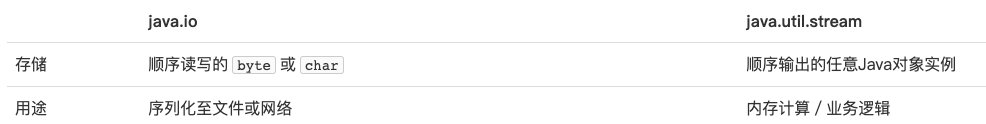
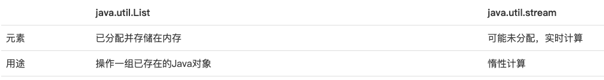
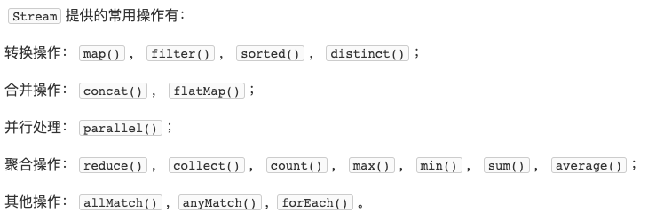
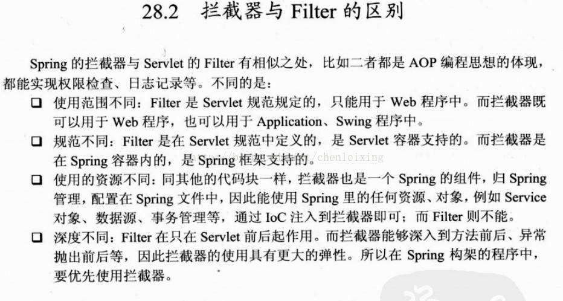

# learn-2

## 1.Java 8：Stream

Java从8开始，不但引入了Lambda表达式，还引入了一个全新的流式API：Stream API。它位于`java.util.stream`包中。这个`Stream`不同于`java.io`的`InputStream`和`OutputStream`，它代表的是任意Java对象的序列。两者对比如下：



另外，虽然同是顺序输出 Java 对象序列，但是它和 `List` 也不一样。`List`存储的每个元素都是已经存储在内存中的某个Java对象，而`Stream`输出的元素可能并没有预先存储在内存中，而是实时计算出来的。换句话说，`List`的用途是操作一组已存在的Java对象，而`Stream`实现的是惰性计算，两者对比如下：



Stream 有如下几个特点：

1. 它可以“存储”有限个或无限个元素。这里的存储打了个引号，是因为元素有可能已经全部存储在内存中，也有可能是根据需要实时计算出来的。
2. 一个`Stream`可以轻易地转换为另一个`Stream`，而不是修改原`Stream`本身。
3. 真正的计算通常发生在最后结果的获取，也就是惰性计算。中间过程只是将一个`Stream`转换为另一个`Stream`时，实际上只存储了转换规则，并没有任何计算发生。

因此，Stream API的基本用法就是：创建一个`Stream`，然后做若干次转换，最后调用一个求值方法获取真正计算的结果。

> Stream 流中间过程等处理顺序也是很重要的一点，例如 filter、map 等中间过程就是垂直执行，而 sort 则是垂直执行……再还有就是 Stream 的复用，具体可以参考文章：https://juejin.cn/post/6844903830254010381#heading-0。

### 1.1.创建 Stream

**Stream.of()**，创建`Stream`最简单的方式是直接用`Stream.of()`静态方法，传入可变参数即创建了一个能输出确定元素的`Stream`。实例代码如下：

```java
Stream<String> stream = Stream.of("A", "B", "C", "D");
// forEach()方法相当于内部循环调用。
stream.forEach(System.out::println);
```

**基于数组或 Collection**，第二种创建`Stream`的方法是基于一个数组或者`Collection`，这样该`Stream`输出的元素就是数组或者`Collection`持有的元素。

> Java 集合框架主要包括两种类型的容器，一种是集合（Collection），存储一个元素集合，另一种是哈希表（Map），存储键/值对映射。Collection 接口又有 3 种子类型，List、Set 和 Queue。Collection 和 Map 的具体实现类，常用的有 ArrayList、LinkedList、HashSet、LinkedHashSet、HashMap、LinkedHashMap 等等。

```java
Stream<String> stream1 = Arrays.stream(new String[] { "A", "B", "C" });
Stream<String> stream2 = List.of("X", "Y", "Z").stream();
stream1.forEach(System.out::println);
stream2.forEach(System.out::println);
```

把数组变成`Stream`使用`Arrays.stream()`方法。对于`Collection`（`List`、`Set`、`Queue`等），直接调用`stream()`方法就可以获得`Stream`。

> 上述两种创建`Stream`的方法都是把一个现有的序列变为`Stream`，它的元素是固定的。

**基于 Supplier**，创建`Stream`还可以通过`Stream.generate()`方法，它需要传入一个`Supplier`对象：

```java
Stream<String> s = Stream.generate(Supplier<T>);
// Supplier 的定义如下：
@FunctionalInterface
public interface Supplier<T> {
    T get();
}
```

基于`Supplier`创建的`Stream`会不断调用`Supplier.get()`方法来不断产生下一个元素，这种`Stream`保存的不是元素，而是算法，它可以用来表示无限序列。例如，我们编写一个能不断生成自然数的`Supplier`，它的代码非常简单，每次调用`get()`方法，就生成下一个自然数：

```java
public class Main {
    public static void main(String[] args) {
        Stream<Integer> natual = Stream.generate(new NatualSupplier());
        // 注意：无限序列必须先变成有限序列再打印:
        natual.limit(20).forEach(System.out::println);
    }
}

class NatualSupplier implements Supplier<Integer> {
    int n = 0;
    public Integer get() {
        n++;
        return n;
    }
}
```

>对于无限序列，如果直接调用`forEach()`或者`count()`这些最终求值操作，会进入死循环，因为永远无法计算完这个序列，所以正确的方法是先把无限序列变成有限序列，例如，用`limit()`方法可以截取前面若干个元素，这样就变成了一个有限序列，对这个有限序列调用`forEach()`或者`count()`操作就没有问题。

上述代码我们用一个`Supplier<Integer>`模拟了一个无限序列（当然受`int`范围限制不是真的无限大）。如果用`List`表示，即便在`int`范围内，也会占用巨大的内存，而`Stream`几乎不占用空间，因为每个元素都是实时计算出来的，用的时候再算。

> 对于无限序列，如果直接调用`forEach()`或者`count()`这些最终求值操作，会进入死循环，因为永远无法计算完这个序列，**所以正确的方法是先把无限序列变成有限序列**，例如，用`limit()`方法可以截取前面若干个元素，这样就变成了一个有限序列，对这个有限序列调用`forEach()`或者`count()`操作就没有问题。

**其他方法**，创建`Stream`的第三种方法是通过一些API提供的接口，直接获得`Stream`。例如，`Files`类的`lines()`方法可以把一个文件变成一个`Stream`，每个元素代表文件的一行内容：

```java
try (Stream<String> lines = Files.lines(Paths.get("/path/to/file.txt"))) {
    // ...
}
```

此方法对于按行遍历文本文件十分有用。另外，正则表达式的`Pattern`对象有一个`splitAsStream()`方法，可以直接把一个长字符串分割成`Stream`序列而不是数组：

```java
Pattern p = Pattern.compile("\\s+");
Stream<String> s = p.splitAsStream("The quick brown fox jumps over the lazy dog");
s.forEach(System.out::println);
```

**基本类型**，因为 **Java 的范型不支持基本类型**，所以我们无法用`Stream<int>`这样的类型，会发生编译错误。为了保存`int`，只能使用`Stream<Integer>`，但这样会产生频繁的装箱、拆箱操作。**为了提高效率，Java标准库提供了`IntStream`、`LongStream`和`DoubleStream`这三种使用基本类型的`Stream`**，它们的使用方法和范型`Stream`没有大的区别，设计这三个`Stream`的目的是提高运行效率：

```java
// 将int[]数组变为IntStream:
IntStream is = Arrays.stream(new int[] { 1, 2, 3 });
// 将Stream<String>转换为LongStream:
LongStream ls = List.of("1", "2", "3").stream().mapToLong(Long::parseLong);
```

### 1.2.使用 map

`Stream.map()`是`Stream`最常用的一个转换方法，它把一个`Stream`转换为另一个`Stream`。

所谓`map`操作，就是把一种操作运算，映射到一个序列的每一个元素上。例如，对`x`计算它的平方，可以使用函数`f(x) = x * x`。我们把这个函数映射到一个序列1，2，3，4，5上，就得到了另一个序列1，4，9，16，25。代码如下所示：

```java
Stream<Integer> s = Stream.of(1, 2, 3, 4, 5);
Stream<Integer> s2 = s.map(n -> n * n);
```

**查看 Stream 源码，可知 map 的定义如下：**

```java
<R> Stream<R> map(Function<? super T, ? extends R> mapper);
// 其中，Function 的定义如下：
@FunctionalInterface
public interface Function<T, R> {
    // 将 T 类型转换为 R:
    R apply(T t);
}
```

>此处介绍一下 `<? super T, ? extends R>`。
>
>在 Java 泛型中，`?` 表示通配符类型(Wildcard Type)，可以用于表示一个不确定的类型参数。`super` 和 `extends` 是通配符类型的限定符，用于限定通配符表示的类型的上界和下界。
>
>具体来说，`? super T` 表示一种类型，该类型是 T 的父类型或 T 本身。例如，假设有一个类 `Animal` 和一个类 `Cat`，其中 `Cat` 是 `Animal` 的子类，那么 `? super Cat` 表示一种类型，该类型是 `Cat` 的父类型或 `Cat` 本身，可能是 `Animal` 或 `Object` 等。
>
>而 `? extends R` 表示一种类型，该类型是 R 的子类型或 R 本身。例如，假设有一个类 `Shape` 和一个类 `Rectangle`，其中 `Rectangle` 是 `Shape` 的子类，那么 `? extends Shape` 表示一种类型，该类型是 `Shape` 的子类型或 `Shape` 本身，可能是 `Rectangle` 或 `Circle` 等。
>
>在 `map` 方法中，`Function<? super T, ? extends R> mapper` 表示一个函数对象，该函数接受一个类型为 T 的参数（或 T 的超类型），并返回一个类型为 R 的结果（或 R 的子类型）。这意味着，在 `map` 方法中传入的函数可以接受 T 或 T 的任何超类型作为参数，并返回 R 或 R 的任何子类型作为结果。这样做的好处是可以使 `map` 方法更加灵活，可以接受更广泛的类型作为参数。

利用`map()`，不但能完成数学计算，对于字符串操作，以及任何Java对象都是非常有用的。例如：

```java
public class Main {
    public static void main(String[] args) {
        List.of("  Apple ", " pear ", " ORANGE", " BaNaNa ")
                .stream()
                .map(String::trim) // 去空格
                .map(String::toLowerCase) // 变小写
                .forEach(System.out::println); // 打印
    }
}
```

通过若干步`map`转换，可以写出逻辑简单、清晰的代码。

### 1.3.使用 filter

`Stream.filter()`是`Stream`的另一个常用转换方法。所谓 `filter()` 操作，就是对一个 `Stream` 的所有元素一一进行测试，不满足条件的就被“滤掉”了，剩下的满足条件的元素就构成了一个新的`Stream`。例如，过滤所有偶数：

```java
IntStream.of(1, 2, 3, 4, 5, 6, 7, 8, 9)
                .filter(n -> n % 2 != 0)
                .forEach(System.out::println);
```

从结果可知，经过`filter()`后生成的`Stream`元素可能变少。`filter()`方法接收的对象是`Predicate`接口对象，它定义了一个`test()`方法，负责判断元素是否符合条件：

```java
Stream<T> filter(Predicate<? super T> predicate);
// Predicate 的定义如下：
@FunctionalInterface
public interface Predicate<T> {
    // 判断元素t是否符合条件:
    boolean test(T t);
}
```

`filter()` 除了常用于数值外，也可应用于任何 Java 对象，实例代码如下：

```java
public class Main {
    public static void main(String[] args) {
        Stream.generate(new LocalDateSupplier())
                .limit(31)
                .filter(ldt -> ldt.getDayOfWeek() == DayOfWeek.SATURDAY || ldt.getDayOfWeek() == DayOfWeek.SUNDAY)
                .forEach(System.out::println);
    }
}

class LocalDateSupplier implements Supplier<LocalDate> {
    LocalDate start = LocalDate.of(2020, 1, 1);
    int n = -1;
    public LocalDate get() {
        n++;
        return start.plusDays(n);
    }
}
```

### 1.4.使用 reduce

`map()`和`filter()`都是`Stream`的转换方法，而`Stream.reduce()`则是`Stream`的一个聚合方法，它可以把一个`Stream`的所有元素按照聚合函数聚合成一个结果。来看一个简单的聚合方法：

```java
int sum = Stream.of(1, 2, 3, 4, 5, 6, 7, 8, 9).reduce(0, (acc, n) -> acc + n); // sum == 45
```

`reduce()`方法传入的对象是`BinaryOperator`接口，它定义了一个`apply()`方法，负责把上次累加的结果和本次的元素 进行运算，并返回累加的结果：

```java
T reduce(T identity, BinaryOperator<T> accumulator);
// BinaryOperator 的定义如下：
@FunctionalInterface
public interface BinaryOperator<T> {
    // Bi操作：两个输入，一个输出
    T apply(T t, T u);
}
```

实际上：

```java
int sum = Stream.of(1, 2, 3, 4, 5, 6, 7, 8, 9).reduce(0, (acc, n) -> acc + n);
<==>
int sum = 0;
for (n : stream) {
    sum = (sum, n) -> sum + n;
}
```

### 1.5.输出集合

我们介绍了`Stream`的几个常见操作：`map()`、`filter()`、`reduce()`。这些操作对`Stream`来说可以分为两类，**一类是转换操作**，即把一个`Stream`转换为另一个`Stream`，例如`map()`和`filter()`，**另一类是聚合操作**，即对`Stream`的每个元素进行计算，得到一个确定的结果，例如`reduce()`。区分这两种操作是非常重要的，因为对于`Stream`来说，**对其进行转换操作并不会触发任何计算**。

转换操作只是保存了转换规则，无论我们对一个`Stream`转换多少次，都不会有任何实际计算发生。而聚合操作则不一样，聚合操作会立刻促使`Stream`输出它的每一个元素，并依次纳入计算，以获得最终结果。所以，对一个`Stream`进行聚合操作，会触发一系列连锁反应。对一个`Stream`做聚合计算后，结果就不是一个`Stream`，而是一个其他的Java对象。

**输出为 List**

`reduce()`只是聚合操作的其中一种，如果我们希望把`Stream`的元素保存到集合，例如`List`，因为`List`的元素是确定的Java对象，因此，把`Stream`变为`List`不是一个转换操作，而是一个聚合操作，它会强制`Stream`输出每个元素。

例如，下面的代码演示了如何将一组`String`先过滤掉空字符串，然后把非空字符串保存到`List`中：

```java
public class Main {
    public static void main(String[] args) {
        Stream<String> stream = Stream.of("Apple", "", null, "Pear", "  ", "Orange");
        List<String> list = stream.filter(s -> s != null && !s.isBlank()).collect(Collectors.toList());
        System.out.println(list);
    }
}
```

把`Stream`的每个元素收集到`List`的方法是调用`collect()`并传入`Collectors.toList()`对象，它实际上是一个`Collector`实例，通过类似`reduce()`的操作，把每个元素添加到一个收集器中（实际上是`ArrayList`）。

> 类似的，`collect(Collectors.toSet())`可以把`Stream`的每个元素收集到`Set`中。

**输出为数组**

把Stream的元素输出为数组和输出为List类似，我们只需要调用`toArray()`方法，并**传入数组的“构造方法”**：

```java
List<String> list = List.of("Apple", "Banana", "Orange");
String[] array = list.stream().toArray(String[]::new);
```

**输出为 Map**

如果我们要把 Stream 的元素收集到Map中，就稍微麻烦一点。因为对于每个元素，添加到Map时需要key和value，因此，我们要指定两个映射函数，分别把元素映射为key和value：

```java
public class Main {
    public static void main(String[] args) {
        Stream<String> stream = Stream.of("APPL:Apple", "MSFT:Microsoft");
        Map<String, String> map = stream
                .collect(Collectors.toMap(
                        // 把元素s映射为key:
                        s -> s.substring(0, s.indexOf(':')),
                        // 把元素s映射为value:
                        s -> s.substring(s.indexOf(':') + 1)));
        System.out.println(map);
    }
}
```

### 1.6.其他操作



## 2.Java 8：接口默认方法

参考文章：https://segmentfault.com/a/1190000017433982。

接口默认的语法格式：

```java
interface InterfaceA {
    default void print() {
        System.out.println("InterfaceA print");
    }
}
```

在 Java 8之前，接口与其实现类之间的耦合度太高了，当需要为一个接口添加方法时，所有的实现类都必须随之修改。默认方法解决了这个问题，它可以为接口添加新的方法，而不会破坏已有的接口的实现。

例如， `forEach` 方法是 jdk 1.8 新增的接口默认方法，正是因为有了默认方法的引入，才不会因为 `Iterable` 接口中添加了 `forEach` 方法就需要修改所有 `Iterable` 接口的实现类。

> 此外，Java 8 的另一个特性是接口可以声明（并且可以提供实现）静态方法：
>
> ```java
> interface InterfaceA {
>     default void print() {
>         System.out.println("InterfaceA print");
>     }
> 
>     static void staticMethod(){
>         System.out.println("InterfaceA staticMethod");
>     }
> }
> ```

## 3.SpringMVC 的 Controller 层的方法中，HttpServletRequest 和 HttpServletResponse 参数的顺序是强制的吗？

在 Spring MVC 中，对于 Controller 层的方法，HttpServletRequest 和 HttpServletResponse 参数的顺序不是强制的。虽然 Servlet 规范和 Spring MVC 的推荐方式是将这两个参数放在方法参数列表的最后，但是在实际开发中，有时也会将它们放在其他位置。

在 Spring MVC 中，对于方法参数的解析，会根据方法的参数类型和注解来确定参数的值。如果方法的参数类型是 HttpServletRequest 或 HttpServletResponse，那么 Spring MVC 会将它们作为控制器方法的参数，并将它们绑定到当前请求的 HttpServletRequest 和 HttpServletResponse 对象上。

**在这种情况下，Spring MVC 会根据参数类型来确定参数的值，而不是根据参数的位置。因此，即使将 HttpServletRequest 和 HttpServletResponse 参数放在方法参数列表的其他位置，也不会影响它们的值**。

但是，尽管参数顺序不是强制的，还是建议遵循 Servlet 规范和 Spring MVC 的推荐方式，将 HttpServletRequest 和 HttpServletResponse 参数放在方法参数列表的最后，以避免混淆和错误，并提高代码的可读性和可维护性。

## 4.Spring MVC 中的 Model、View 与 ModelAndView

> SpringMVC 阶段依旧是没有完成前后端分离工作，因此还会存在 View（一般是 JSP 或者 Thymeleaf）。

**Model 是什么？**

model 意为模型，在 MVC 架构中承担 “M” 的部分，用来传输数据。

> 注意，这里的数据主要是用于填充模板引擎做后端渲染，当然也可以用作 JSON 数据返回。

**View 是什么？**

由于 SpringMVC 阶段依旧没有前后端分离工作，因此仍然需要后端完成模板引擎的渲染工作，View 负责它。

**ModelAndView 是什么？**

ModelAndView 翻译过来就是”模型和视图“，可以理解成MVC架构中的”M“和”V“，其中包含”Model“和”view“两部分，主要功能是：

- 设置转向地址。
- 将底层获取的数据进行存储（或者封装）。
- 最后将数据传递给View。

> View 与 ModelAndView 都可以实现返回静态页面（JSP 或者 Thymeleaf）。s

参考文章：https://www.longkui.site/program/java/springmvc7/1256/。

>关于响应的静态页面：
>
>1. 有 `ModelAndView mav = new ModelAndView("/demo2/show"); ` 或者 `View`，直接返回 View 映射的静态页面（此时的 RequestMapping 只起到了 Servlet 路由的作用）。
>2. 没有 View，但有 @RequestMapping("/demo2/show")，返回 RequestMapping 映射的静态页面。
>3. 返回 String，那么返回该 String URL 映射的静态页面（此时的 RequestMapping 只起到了 Servlet 路由的作用）。
>4. void 响应，那么返回 RequestMapping 映射的静态页面。
>5. 如果方法声明了注解@ResponseBody ，则会直接将返回值输出到页面。

## 5.Java Web、Spring MVC 到 SpringBoot 的演进

参考文章：https://www.zhihu.com/question/509707651/answer/2512335914

Java Web -> Spring MVC：

1. 将 Servlet 的请求处理从“类”维度改为“方法”维度，但底层依旧是 Servlet。
2. 基于 xml 和注解共同管理 Servlet（之前是纯粹地使用 xml 管理所有的 Servlet，配置文件冗长）。
3. 支持多种模板引擎，例如 Thymeleaf，开始了对前后端分离的简单应用。

> 后来 Spring5 推出了 SpringWebFlux，有点抢 SpringMVC 饭碗的意思。

Spring MVC -> SpringBoot：

1. 基于约定优于配置，极大地简化了 Spring 项目在整合开始时的配置流程。
   * 自动配置 Bean，SpringBoot 会为我们项目中类路径的 jar 包进行 Bean 的自动配置。
   * Spring Boot 提供了一系列的 starter pom 用来简化我们的 Maven 依赖。
   * 抛弃 xml，将自定义配置放在了 yaml 文件或者 properties 文件中。
2. 内嵌 Tomcat 容器，从而使得项目可以做到一键启动（不需要额外配置外部的 Tomcat 服务）。此外，SpringBoot 还可以做到以 jar 包形式打包 web 应用程序。

> 可以跳过 SpringMVC 直接学习 SpringBoot 吗：https://www.zhihu.com/question/527283820/answer/2518307760

## 6.继承、多态

### 6.1.protected

子类无法访问父类的 private 的属性或者方法，为此可以把 private 改为 protected。

用保护访问控制符 protected 修饰的类成员可以被三种类所访问：**该类自身、与它在同一个包中的其他类以及在其他包中的该类的子类**。使用 protected 修饰符的主要作用，是允许其他包中它的子类来访问父类的特定属性和方法，否则可以使用默认访问控制符。

### 6.2.向上转型

定义一个父类，可以使用子类将其初始化，以 Person 和 Student 为例，Student 拥有 Person 的全部功能，因此，`Person`类型的变量，如果指向`Student`类型的实例，对它进行操作，是没有问题的。

这种把一个子类类型安全地变为父类类型的赋值，被称为向上转型（upcasting），向上转型实际上是把一个子类型安全地变为更加抽象的父类型。

### 6.3.向下转型

和向上转型相反，如果把一个父类类型强制转型为子类类型，就是向下转型（downcasting）。例如：

```java
Person p1 = new Student(); // upcasting, ok
Person p2 = new Person();
Student s1 = (Student) p1; // ok
Student s2 = (Student) p2; // runtime error! ClassCastException!
```

如果测试上面的代码，可以发现：

`Person`类型`p1`实际指向`Student`实例，`Person`类型变量`p2`实际指向`Person`实例。在向下转型的时候，把`p1`转型为`Student`会成功，因为`p1`确实指向`Student`实例，把`p2`转型为`Student`会失败，因为`p2`的实际类型是`Person`，不能把父类变为子类，因为子类功能比父类多，多的功能无法凭空变出来。

因此，向下转型很可能会失败。失败的时候，Java虚拟机会报`ClassCastException`。

为了避免向下转型出错，Java提供了`instanceof`操作符，可以先判断一个实例究竟是不是某种类型：

```java
Person p = new Person();
System.out.println(p instanceof Person); // true
System.out.println(p instanceof Student); // false

Student s = new Student();
System.out.println(s instanceof Person); // true
System.out.println(s instanceof Student); // true

Student n = null;
System.out.println(n instanceof Student); // false
```

**`instanceof`实际上判断一个变量所指向的实例是否是指定类型，或者这个类型的子类**。如果一个引用变量为`null`，那么对任何`instanceof`的判断都为`false`。

利用`instanceof`，在向下转型前可以先判断：

```java
Person p = new Student();
if (p instanceof Student) {
    // 只有判断成功才会向下转型:
    Student s = (Student) p; // 一定会成功
}
```

### 6.4.多态性

假设有 `Person p = new Student();`，那么在调用 `p.run()` 时，调用的是`Person`还是`Student`的`run()`方法？实际上调用的方法是`Student`的`run()`方法。因此可得出结论：

**Java的实例方法调用是基于运行时的实际类型的动态调用，而非变量的声明类型。**

> 但是在自动补全时是根据声明类型的。

这个非常重要的特性在面向对象编程中称之为多态。针对某个类型的方法调用，其真正执行的方法取决于运行时期实际类型的方法。

> 多态具有一个非常强大的功能，就是允许添加更多类型的子类实现功能扩展，却不需要修改基于父类的代码。

### 6.5.final

继承可以允许子类覆写父类的方法。如果一个父类不允许子类对它的某个方法进行覆写，可以把该方法标记为`final`。用`final`修饰的方法不能被`Override`。

如果一个类不希望任何其他类继承自它，那么可以把这个类本身标记为`final`。用`final`修饰的类不能被继承。

对于一个类的实例字段，同样可以用`final`修饰。用`final`修饰的字段在初始化后不能被修改。

> 可以在构造方法中初始化final字段。

## 7.拦截器与过滤器的区别

参考文章：https://www.cnblogs.com/chengxy-nds/p/13042013.html。




## 8.MySQL 的架构

mysql 分为 server 和 client，要和 mysql 交互的话需要启动 client。

> cmd 可以在命令行中使用 exe 文件，git bash 则不行（归根到底还是 win 和类 Unix 的区别）。
>
> 


