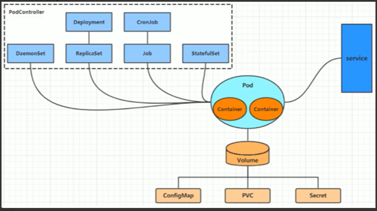
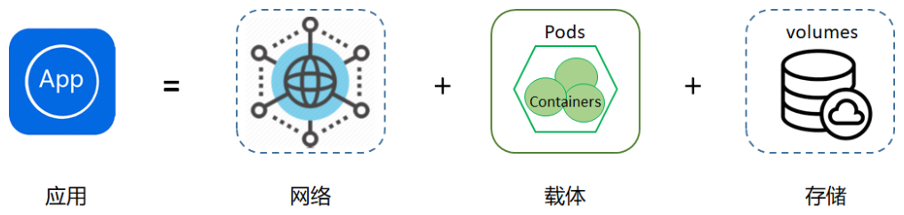

# learn-5

## 1.k8s 资源管理

参考文章：https://www.cnblogs.com/zackstang/p/14433606.html。

### 1.1.k8s 资源及其管理方式

在 kubernetes 中，所有内容都抽象为资源，用户需要操作资源来管理 kubernetes。

* Kubernetes 的最小管理单元是 Pod 而不是容器，所以只能将容器放在 Pod 中，而 kubernetes 一般也不会直接管理 Pod，而是通过 Pod 控制器（它是一类资源）来管理 Pod。
* Pod 可以提供服务之后，就要考虑如何访问 Pod 中的服务，kubernetes 提供了 Service 资源实现这个功能。
* 如果 Pod 中的程序的数据需要持久化，kubernetes 还提供了各种存储系统。

如下图所示：



PodController 也是一类资源，Container 运行在 Pod 中。通过 Service 进行代理，实现外部访问。一个比较通俗的公式即是：



> 其中网络即是 Service，载体即是 PodController，存储即是 Volume。

在 k8s 中有三种资源管理方式：

1. 命令式对象管理：直接使用命令去操作kubernetes资源。例如：`kubectl run nginx-pod --image=nginx:1.17.1 --port 80`。

2. 命令式对象配置：通过命令配置和配置文件去操作kubernetes资源。例如：`kubectl create/patch -f nginx-pod.yaml`。

3. 声明式对象配置：通过apply命令和配置文件去操作kubernetes资源。例如：`kubectl apply -f nginx-pod.yaml`。

   > `apply` 这里只用于创建和更新资源，如果 `pod` 没有，则创建；如果已经有了，则更新。

### 1.2.命令式对象管理

`kubectl` 是 `kubernetes` 集群的命令行工具，通过它能够对集群本身进行管理，并能够在集群上进行容器化应用的安装部署。语法如下：

```bash
kubectl [command] [type] [name] [flags]
```

其中：

* command：指定要对资源执行的操作，例如 create、get、delete。
* type：指定资源类型，比如 deployment、pod、service。
* name：指定资源的名称，名称大小写敏感。
* flags：指定额外的可选参数。

例如：

```bash
# 查看所有pod
$ kubectl get pod
NAME                     READY   STATUS    RESTARTS   AGE
nginx-55f8fd7cfc-7qzdd   1/1     Running   0          116m
nginx-pod                1/1     Running   0          43m

# 查看某个 pod
$ kubectl get pod nginx-pod
NAME        READY   STATUS    RESTARTS   AGE
nginx-pod   1/1     Running   0          43m

# 查看pod 详细信息
$ kubectl get pod nginx-pod -o wide
NAME        READY   STATUS    RESTARTS   AGE   IP           NODE                                        NOMINATED NODE   READINESS GATES
nginx-pod   1/1     Running   0          44m   10.0.1.216   ip-10-0-1-217.cn-north-1.compute.internal   <none>           <none>

# 以 yaml 格式展示结果
$ kubectl get pod nginx-pod -o yaml
```

对于 `command`，可以通过 `kubectl --help` 了解命令的用法。

对于 `type`，可以通过命令 `kubectl api-resources` 查看

### 1.3.命令式对象配置

命令式对象配置就是使用命令配合配置文件一起来操作kubernetes资源，以下是一个简单示例：

* 创建一个 `nginx-pod.yaml`：

  ```yaml
  apiVersion: v1
  kind: Namespace
  metadata:
    name: dev
  
  ---
  # 如果将多段 yaml 放在同一个文件中，中间必须用 3 个横杠 --- 进行分隔.
  
  apiVersion: v1
  kind: Pod
  metadata:
    name: nginxpod
    namespace: dev
  spec:
    containers:
      - # 在 yaml 中，使用 - 来表示数组元素，此处表示对象数组。
        name: nginx-containers
        image: nginx:1.17.1
  ```

  > yaml 转 json 的网站：http://json2yaml.com/convert-yaml-to-json。

* 使用命令式对象配置的方式创建：

  ```bash
  $ kubectl create -f yamls/nginxpod.yaml
  namespace/dev created
  pod/nginxpod created
  ```

* 删除资源：

  ```bash
  $ kubectl delete -f yamls/nginxpod.yaml
  namespace "dev" deleted
  pod "nginxpod" deleted
  ```

命令式对象配置的方式操作资源，可以简单的认为：命令 + yaml 配置文件（里面是命令需要的各种参数）。

### 1.4.声明式对象配置

声明式对象配置就是使用 `apply` 描述一个资源最终的状态（在 `yaml` 中定义状态）。

使用 `apply` 操作资源：

1. 如果资源不存在，就创建；相当于 `kubectl create`。
2. 如果资源已存在，就更新；相当于 `kubectl patch`。

## 2.application.yaml 配置相关

> 此外还有大量的 mybatis plus 配置，参考 mybatis plus 官网：https://baomidou.com/pages/56bac0/#%E5%9F%BA%E6%9C%AC%E9%85%8D%E7%BD%AE。

**什么是 spring.session.timeout？**

在了解该配置项之前，首先需要了解一下 SpringSession。

在 Web 项目开发中，Session 会话管理是一个很重要的部分，用于存储与记录用户的状态或相关的数据。通常情况下，Session 交由容器（tomcat）来负责存储和管理，但是如果项目部署在多台 tomcat 中，则 Session 管理存在很大的问题：

1. 多台 tomcat 之间无法共享 session ，当负载均衡跳转到其它 tomcat 时，session 就失效了，用户就退出了登录。
2. 一旦 tomcat 容器关闭或重启也会导致 session 会话失效。

为了解决这样的难题，Spring 发起 Spring Session 项目，它提供了用于管理用户会话信息的 API 和实现。它把servlet 容器实现的 HttpSession 替换为 spring-session ，Session 信息存储在 Redis 或其它数据库中统一管理，解决了 session 共享的问题。

而这里的 spring.session.timeout 就是 Spring Session 框架中的一个属性，它用来设置 session 的过期时间，超过这个时间后，会话将会失效，需要重新登录才能继续使用应用程序。

**什么是 server.address？**

在 Spring 的配置文件中，`server.address` 是用于配置 Spring Boot 应用程序监听的网络地址（IP 地址）。它指定应用程序绑定到的具体网络接口或 IP 地址。

默认情况下，如果未显式设置 `server.address`，Spring Boot 应用程序将监听所有可用的网络接口，即绑定到 0.0.0.0。这意味着**应用程序将监听本机的任何有效 IP 地址**。

我们可以通过在配置文件（如 `application.properties` 或 `application.yml`）中设置 `server.address` 属性来更改应用程序的绑定地址。例如，将其设置为特定的 IP 地址，如 `server.address=192.168.0.100`，将使应用程序仅绑定到该 IP 地址。**这在需要限制应用程序只在特定网络接口上监听或需要指定特定 IP 地址时非常有用**。

**什么是 spring.application.name？**

spring.application.name 是Spring Boot 应用程序的配置属性，它**用于指定应用程序的名称**。

**什么是 server.servlet.context-path？**

server.servlet.context-path 是用于指定 Spring Boot 应用程序的上下文路径（Context Path）的属性。上下文路径是 URL 中用于标识应用程序的部分，位于主机名和端口号之后，路径的开始部分。

默认情况下，如果没有显式设置 server.servlet.context-path，Spring Boot 应用程序将使用根路径作为上下文路径，即没有任何路径前缀。

您可以在配置文件（如 application.properties 或 application.yml）中设置 server.servlet.context-path 属性来更改应用程序的上下文路径。例如，将其设置为 /myapp，即 server.servlet.context-path=/myapp，将使应用程序的 URL 路径以 /myapp 开头。

**这对于在部署多个应用程序在同一个服务器上时很有用，可以通过不同的上下文路径来区分它们**。例如，如果您将上下文路径设置为 /myapp，则您的应用程序将在 `http://localhost:8080/myapp` 上访问。

## 3.SpringBoot 如何结合 junit 做单元测试

> 单元测试结合 idea 使用，效率更高。

参考文章：

* JUnit5 基本操作：https://blog.csdn.net/boling_cavalry/article/details/108810587。
* Assumptions（假设）类：https://blog.csdn.net/boling_cavalry/article/details/108861185。
* Assertions（断言）类：https://blog.csdn.net/boling_cavalry/article/details/108899437。
* 按条件执行、标签（Tag）和自定义注解、参数化测试（Parameterized Tests）基础、参数化测试（Parameterized Tests）进阶。

参考代码库：https://github.com/zq2599/blog_demos/tree/master/junitpractice。


